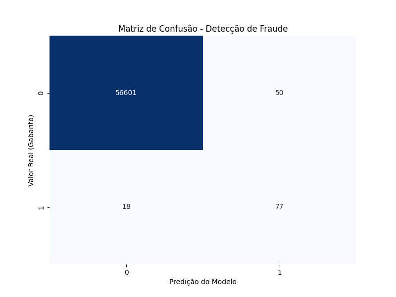
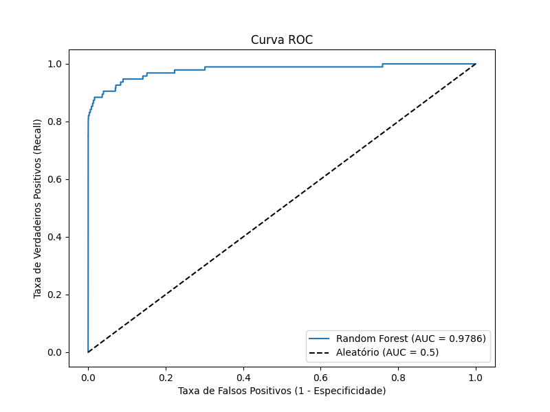

# Fraud Detection ML API

 - Essa é uma API de Machine Learning que usa um modelo de Random Forest para prever fraudes com base em um conjunto de dados de transações de cartão de crédito.

# **O que é Machine Learning?**

Técnica na qual sistemas de computador aprendem com dados e melhoram seu desempenho em uma tarefa específica sem serem explicitamente programados para ela. Em vez de receber um conjunto de regras rígidas, o algoritmo é "treinado" com grandes volumes de dados, encontrando padrões e criando um modelo preditivo ou de decisão.

# **Principais Tipos de Machine Learning**

As três categorias principais de aprendizado:

### **Aprendizado Supervisionado (Supervised Learning)**

 - O algoritmo é treinado com dados rotulados, ou seja, pares de entrada e saída esperada.

 - O objetivo é aprender a mapear a entrada para a saída correta.

 - Exemplos:

	 - **Classificação** - Ex: Identificar se um e-mail é spam ou não

	 - **Regressão** - Ex: Prever o preço de uma casa).

### **Aprendizado Não Supervisionado (Unsupervised Learning)**

 - O algoritmo é treinado com dados não rotulados.

 - O objetivo é encontrar padrões, estruturas ou agrupamentos ocultos nos dados.

 - Exemplos:

	 - **Clusterização** - Ex: Agrupar clientes com base em similaridades de compra

	 - **Redução de Dimensionalidade** - ???

### **Aprendizado por Reforço (Reinforcement Learning)**

- O algoritmo (Agente) aprende por meio da interação com um ambiente dinâmico, recebendo recompensas por ações desejadas e punições por ações indesejadas.

- O objetivo é maximizar a recompensa cumulativa.

- Exemplos: 
	- Treinamento de robôs, sistemas de jogos e veículos autônomos.

### **Pipeline de Dados do Modelo de Machine Learning**
- Definição do Problema
- Extração e Ingestão de Dados
- Análise Exploratória dos Dados
- Limpeza e Preparação dos Dados
- Treinamento do Modelo (Experimentar Modelos)
- Avaliação do Modelo (Validação do Modelo)
- Deploy do Modelo (Produção)
- Monitoramento do Modelo (Produção)
- Atualização do Modelo (Produção)

---------------

# 1. SETUP

## 1.1 Versões de Python e pip do sistema:

 ```bash
python --version
python3 --version
```
 - Verificar os caminhos executáveis de Python instalados no sistema:

```bash
which -a python python3
```

 - Verificar versões instaladas via pyenv:

```bash
pyenv versions
```

 - Verificar versão do ambiente virtual:

```bash
python -V
```
 -  Verificar a versão do pacote pip:

```bash
pip --version
```

## 1.2 Versionador de código (Git e GitHub):

```bash
git --version
git config --global user.name "phmcasimiro"
git config --global user.email "phmcasimiro@gmail.com"
```

 - Criar Repositório no GitHub e sincronizar com o repositório local:

```bash
# GitHub - Criação de repositório na Nuvem

# 1. Acessar o GitHub
<https://github.com/phmcasimiro>

# 2. Escolha o nome do repositório
<FraudDetection>

# 3. Escolha o nível de acesso (público ou privado)
<Público>

# 4. Crie o repositório (sem marcar nada em "initialize this repository with...")
<https://github.com/phmcasimiro/FraudDetection.git>

# Git - Sincronização de repositório local com o repositório na Nuvem
# 1. Inicialize o Git localmente
git init

# 2. Adicione os arquivos ao "palco"
git add .

# 3. Crie o primeiro commit (ponto de partida)
git commit -m "feat: Estrutura inicial do projeto de Detecção de Fraudes"

# 4. Renomeie a branch para main
git branch -m main

# 5. Conecte o repositório local ao GitHub
# Substitua pela URL que você copiou
git remote add origin https://github.com/phmcasimiro/FraudDetection.git

# 6. Envie o código para o GitHub
git push -u origin main
```

## 1.3 GERENCIADOR DE PROJETOS (GitHub Projects)
 - O GitHub Projects é uma ferramenta que permite gerenciar projetos de forma colaborativa.
 - Utilizaremos neste projeto para gerenciar as tarefas de desenvolvimento e construir um histórico de progresso.

```bash
# 1. Entrar no GitHub Projects
<https://github.com/users/phmcasimiro/projects/2>

# 2. Canto superior direito, clicar em "settings"
<https://github.com/users/phmcasimiro/projects/2/settings>

# 3. Selecionar Default Repository "FraudDetection"
```

## 1.4 ESTRUTURA DE DIRETÓRIOS

```bash
# Linux - Criação de diretórios
mkdir src
mkdir src/api
mkdir src/data
mkdir src/models
mkdir tests
mkdir logs
mkdir artifacts
mkdir artifacts/models
```
``` bash
# Estrutura de diretórios FraudDetection
├── artifacts/
│   └── models/
├── logs/
├── src/
│   ├── __init__.py
│   ├── config.py
│   ├── api/
│   │   ├── __init__.py
│   │   └── main.py
│   ├── data/
│   │   ├── __init__.py
│   ├── models/
│   |   └── __init__.py
│   ├── schemas/
│   |   ├── __init__.py
│   │   └── schemas.py
│   ├── services/
│   |   ├── __init__.py
│   │   └── services.py
├── tests/
│   └── __init__.py
├── .gitignore
├── requirements.txt
└── README.md
```

## 1.5 CRIAR ARQUIVOS `__init__.py`
 - Arquivos .py são considerados módulos em Python, e o arquivo `__init__.py` é um arquivo especial que define um diretório como um pacote Python.

```bash
# Linux - Criação de arquivos .py
touch src/__init__.py
touch src/api/__init__.py
touch src/data/__init__.py
touch src/models/__init__.py
touch tests/__init__.py
```

## 1.6 CRIAR ARQUIVOS DE CONFIGURAÇÃO DO PROJETO

**`.gitignore`**

```
venv/
__pycache__/
*.pyc
.pytest_cache/
.mypy_cache/
.ruff_cache/
logs/*.log
.env
*.pkl
.DS_Store
```

**`requirements.txt`**
```
fastapi==0.109.0
uvicorn[standard]==0.27.0
pydantic==2.6.0
pytest==7.4.3
pytest-cov==4.1.0
black==24.1.1
ruff==0.1.15
mypy==1.8.0
httpx==0.26.0
scikit-learn==1.4.0
```
### 1.7 INSTALAR BIBLIOTECAS
```bash
pip install -r requirements.txt
```

### 1.8 TESTE FASTAPI
 - Criar arquivo **`test_api.py`**
```bash
from fastapi import FastAPI
app = FastAPI()
@app.get("/")
def read_root():
return {"message": "Setup funcionando!"}
```
- Executar o arquivo **`test_api.py`**
```bash
uvicorn test_api:app --reload
```
 - Após o teste, **deletar** arquivo **`test_api.py`**

### 1.9 VERIFICAÇÃO FINAL DE AMBIENTE

```bash
python --version
pip --version
git --version
pip show fastapi
pip show pytest
```
------

### 2. Extração e Ingestão de Dados

#### 2.1 Extração e Ingestão de Dados
- Criar um script `src/data/download_data.py` para baixar o dataset mais atualizado .

```bash
import kagglehub
import shutil
import os

def download_dataset():
    print("Iniciando download do Kaggle...")
    # Baixa a versão mais recente do dataset
    path = kagglehub.dataset_download("mlg-ulb/creditcardfraud")
    
    # O kagglehub baixa o arquivo .csv para um cache.
    source_file = os.path.join(path, "creditcard.csv") # Localiza o arquivo .csv baixado
    destination_path = "src/data/creditcard.csv" # Define o caminho de destino
    
    # Move o arquivo para sua pasta de dados do projeto
    if os.path.exists(source_file):
        shutil.move(source_file, destination_path)
        print(f"Dataset movido com sucesso para: {destination_path}")
    else:
        print(f"Erro: Arquivo não encontrado em {source_file}")

if __name__ == "__main__":
    download_dataset()
```

### 3. Análise Exploratória de Dados (EDA)
- Antes de começar a codificar a API, é necessário entender os dados. 
- Verificar a correlação das variáveis `V1` a `V28` e a distribuição da variável alvo `Class`.
- Criar um script `src/data/eda.py` para implementar uma análise exploratória de dados (EDA) .
- **OBS:** Serão usadas bibliotecas de visualização que salvam gráficos como arquivos na pasta `artifacts/`.

```bash
import pandas as pd
import seaborn as sns
import matplotlib.pyplot as plt
import os

def run_eda():
    # 1. Carregar os dados
    df = pd.read_csv("src/data/creditcard.csv")
    
    # Criar pasta para salvar gráficos (se não existir)
    os.makedirs("artifacts", exist_ok=True)

    # 2. Analisar Distribuição da Classe (Target)
    print("Analisando distribuição de classes...")
    plt.figure(figsize=(8, 6)) # Define o tamanho da figura
    sns.countplot(x='Class', data=df) # Cria o gráfico de contagem
    plt.title("Distribuição: 0 (Normal) vs 1 (Fraude)") # Define o título do gráfico
    plt.savefig("artifacts/distribuicao_classe.png") # Salva o gráfico
    
    # Imprimir proporção no terminal
    print(df['Class'].value_counts(normalize=True))

    # 3. Analisar Correlação
    print("Gerando matriz de correlação...")
    # Calculando correlação de todas as variáveis com a Classe
    correlations = df.corr()['Class'].sort_values(ascending=False)
    
    # Gerar Heatmap das correlações
    plt.figure(figsize=(12, 10)) # Define o tamanho da figura
    sns.heatmap(df.corr(), annot=False, cmap='coolwarm') # Cria o heatmap
    plt.title("Matriz de Correlação Global") # Define o título do gráfico
    plt.savefig("artifacts/matriz_correlacao.png") # Salva o gráfico
    
    print("EDA concluída. Gráficos salvos em /artifacts")

if __name__ == "__main__":
    run_eda()
```

#### **3.1 Distribuição da Variável Alvo (`Class`):**

<p align="center">
  
</p>

- A coluna `Class` possui dois valores: **0** (legítima) e **1** (fraude).

- É essencial verificar o balanceamento/desbalanceamento das variáveis, então, usaremos um gráfico de barras (Distribuição de Classes) para visualizar isso.

- Em fraudes, a classe "1" (fraude) costuma ser uma fração mínima, isto é, há uma barra enorme no 0 e uma quase invisível no 1.

- Em Machine Learning, isso é uma **Classe Desbalanceada**. Caso o modelo seja treinado assim, aprenderá que "quase sempre não é fraude" e ignorará as fraudes reais.

- Analisando o gráfico `distribuicao_classe.png` é possível verificar uma coluna gigante no valor **0** (Transações Legítimas) e uma quase invisível no valor **1** (Fraudes).
    
-   Em Machine Learning, isto exemplifica o conceito de **Desbalanceamento de Classe Severo**, isto é, no  dataset, menos de 0.2% dos dados são fraude.
    
-   Se o desbalanceamento não for tratado, o modelo de Random Forest aprenderá a sempre classificar como "0" (Transação Legítima), pois ele terá 99.8% de acurácia fazendo isso, mesmo falhando em detectar todas as fraudes.
   
- **Importante:** Vamos focar na métrica **Recall** a fim de não ignorar nenhuma fraude, mesmo que isso gere alguns alarmes falsos (Falsos Positivos).


#### **3.2 Correlação das Variáveis `V1` a `V28`**

<p align="center">
  
</p>

- Neste dataset as variáveis `V1` a `V28` são resultado de um **PCA** (Principal Component Analysis).

- O PCA transforma variáveis originais em novos componentes que são **independentes** entre si. 

- Logo, se fizermos uma matriz de correlação entre as variáveis, a correlação será próxima de zero (0).

- O Foco da Análise é a correlação das variáveis com a variável `Class/Fraude`, ou seja, descobrir quais variáveis `V` têm mais poder preditivo (influência) para determinar fraudes.

- O gráfico utiliza uma **escala de cores** para demonstrar a **força da relação entre as variáveis**.

- **Vermelho Forte** indica uma **correlação positiva perfeita (valor 1)**, isto é, quando uma variável aumenta, a outra também aumenta. Por isso há uma **linha vermelha na diagonal principal**, a qual representa a **correlação de uma variável consigo mesma**.

- **Azul Forte** indica uma **correlação negativa forte (valor -1)**, isto é, quando uma variável aumenta, a outra tende a diminuir.

- **Cores Claras/Neutras** Indicam **correlações fracas ou nulas (valor 0)**, ou seja, as variáveis apresentam comportamento independente entre si.

- O **Centro do gráfico** é marcado por cores neutras e azul clara, isto é, as variáveis não possuem correlação entre si em razão da técnica PCA aplicada ao conjunto de dados. Em outras palavras, as variáveis `V1` a `V28` têm correlação zero entre si (as células do mapa de calor fora da diagonal são neutras em sua maioria). A razão desse fenômeno é a aplicação da técnica **PCA** (Análise de Componentes Principais), uma técnica de engenharia de features que transforma dados correlacionados em componentes independentes.

- A análise de variância é uma técnica estatística que permite avaliar a variação de uma variável em relação a outra variável. Em outras palavras, verifica-se quais variáveis possuem maior variação quando a `Class/Fraude` é `1` e quando é `0`. Essas variáveis serão as mais importantes para o seu modelo de Random Forest.

Ao analisar a última linha (ou coluna) da matriz, que mostra a correlação com a `Class/Fraude`, verificamos que as variáveis `V17`, `V14` e `V12` apresentam correlações negativas relativamente fortes com a `Class/Fraude`. 

### 4. LIMPEZA E PRÉ-PROCESSAMENTO DOS DADOS

- A partir da identificação das variáveis críticas (V12, V14 e V17) e do desbalanceamento do dataset, a **limpeza e pré-processamento dos dados** garantirão que o modelo de Random Forest seja treinado com dados de qualidade, evitando que o modelo seja enganado pelo ruído dos dados e que ele aprenda a classificar como "0" (Transação Legítima) mesmo falhando em detectar todas as fraudes. 

#### **4.1 VERIFICAÇÃO DE INTEGRIDADE (DATA CLEANING)**

- O objetivo é garantir que todas as entradas estejam em uma escala comparável e que o modelo consiga "enxergar" a fraude apesar da escassez de exemplos de fraudes.

- **TRATAMENTO DE NULOS:** Confirmar que não existem valores NaN ou vazios. Havendo, decidir se deve-se aplicar uma técnica de imputação ou simplesmente remover as linhas com valores nulos.

- **REMOÇÃO DE DUPLICATAS:** Transações identicas podem causar overfitting, ou seja, o modelo decora o dado em vez de aprender o padrão, portanto, devem ser removidas. 

#### **4.1.1 VALIDAÇÃO DE INTEGRIDADE DOS DADOS (PANDERA)**

- Visando garantir um pipeline de dados integro e evitar o processamento de dados corrompidos, foi implementada uma camada de validação (schema) usando a biblioteca **Pandera**.

- **O que é o Pandera e por que usá-lo?**
 
- Se, no futuro, o Kaggle mudar o formato do arquivo (_creditcard.csv_) ou alguma coluna seja disponibilizada como texto em vez de número, isto é, houver qualquer tipo de mudança de formato ou tipo de dados, sem o Pandera, o script falharia de forma silenciosa ou poderia haver um erro matemático no treino.

- O uso do Pandera cria um "vigilante" que verifica o DataFrame, avalia e alerta alterações no dataset, garantindo a integridade estatística do modelo. O Pandera funciona como um contrato de dados, um schema, um molde ao qual o dado que entra no pipeline deve adequar seu formato e tipo. Caso contrário, o Pandera interrompe o processo imediatamente, evitando que o modelo aprenda padrões errados de dados inadequados (Evita o "Garbage In, Garbage Out").

- Foi definido um contrato/schema rígido (`src/data/pandera_schemas.py`) que verifica:
    - **Tipagem:** Garante que colunas V1 a V28, Time e Amount sejam sempre `float`.
    - **Regras de Negócio:** Verifica se a coluna `Amount` possui valores negativos (inválidos para transações).
    - **Consistência do Alvo:** Garante que a coluna `Class` contenha apenas os valores 0 ou 1.
    - **Contrato de Interface:** O strict=True garante que o modelo sempre receba as mesmas 30 variáveis de entrada, evitando erros de dimensão no futuro.

- Desse modo, o pipeline segue o princípio de "Falha Rápida" (Fail-Fast), interrompendo o processo imediatamente caso o contrato de dados (schema) seja violado.

- A documentação desta etapa encontra-se em no [GitHub Projetcs FraudDetection - Task: Qualidade dos Dados](https://github.com/users/phmcasimiro/projects/2/views/1?pane=issue&itemId=148208864&issue=phmcasimiro%7CFraudDetection%7C9)

``` bash
# Project: Fraud Detection
# author: phmcasimiro
# date: 2026-01-07
# Schema for the data


import pandera as pa
from pandera import Column, Check

# Definir schema do dataset
transaction_schema = pa.DataFrameSchema(
    columns={
        "Time": Column(float, nullable=False),
        "Amount": Column(float, Check.greater_than_or_equal_to(0), nullable=False),
        "Class": Column(int, Check.isin([0, 1]), nullable=False),
        **{f"V{i}": Column(float, nullable=False) for i in range(1, 29)} # Usar dicionário para validar V1 até V28
        },
    strict=True, # Garante que não existam colunas extras não mapeadas
    coerce=True  # Tenta converter os dados para o tipo correto se possível
)

def validar_dados(df):
    """
    Função auxiliar para validar o DataFrame
    """
    return transaction_schema.validate(df)
```

#### **4.2 ESCALONAMENTO DE ATRIBUTOS (FEATURE SCALING)**

- As variáveis `V1` a `V28` já estão em uma escala similar devido ao PCA. Contudo, as colunas `Time` e `Amount` possuem escalas completamente diferentes (ex: `Amount` pode ir de 0 a 25.000).

- O Random Forest é menos sensível à escala do que modelos lineares, mas o escalonamento ajuda na convergência e na comparação de importância de features.

- Pode-se aplicar **RobustScaler** ou **StandardScaler** apenas nestas duas colunas para que fiquem na mesma "faixa" das variáveis V.

- **RobustScaler** é mais recomendado para dados com muitos outliers.

- **StandardScaler** é mais recomendado para dados com poucos outliers.

#### **4.3 DIVISÃO DE CONJUNTOS (SPLITING)**

- O dataset será dividido em dois conjuntos: **treino** e **teste**.

- Separar os dados antes de qualquer técnica de balanceamento para evitar o **Data Leakage** (vazamento de dados do teste para o treino).

- O conjunto de **treino** será usado para treinar o modelo.

- O conjunto de **teste** será usado para avaliar o desempenho do modelo (separados para não serem usados no treinamento).

 - **Estratificação**: Deve-se usar o parâmetro `stratify=y` para garantir que a proporção de fraudes (minúscula) seja mantida nos conjuntos de treino e teste.

#### **4.4 BALANCEAMENTO DOS DADOS (SAMPLING)**

- Como a classe 1 (Fraude) é minúscula, o Random Forest precisa de ajuda para dar peso às fraudes.

- **Balanceamento dos dados** é uma técnica que visa equilibrar a proporção de fraudes (minúscula) nos conjuntos de treino e teste.

**Opção A: Oversampling (SMOTE - Synthetic Minority Over-sampling Technique)**

- Em vez de apenas duplicar as fraudes existentes (o que causaria overfitting), o SMOTE cria "fraudes novas" artificiais.

 - Por meio de uma fraude real, avalia as fraudes "vizinhas" mais parecidas e cria um ponto intermediário entre elas. É como se ele interpolasse as características para criar uma fraude que "poderia existir".

 - A vantagem é que não há perda de informação (você mantém todos os dados legítimos). A desvantagem é que pode criar dados ruidosos se as fraudes estiverem misturadas com transações legítimas, confundindo o modelo.

**Opção B: Undersampling (Random Undersampling)**

- Você joga fora aleatoriamente a maioria das transações legítimas até ficar com uma quantidade parecida com a de fraudes (ex: 50/50).

- Se você tem 400 fraudes e 200.000 legítimas, você escolhe 400 legítimas aleatórias e descarta as outras 199.600.

- A vantagem é que treinamento fica ultra-rápido e o modelo foca muito em distinguir as classes. A desvantagem é o perigo de jogar fora 99% dos dados legítimos. O modelo pode deixar de aprender padrões importantes das transações legítimas e começar a dar muito "Falso Positivo" (bloquear cartão de cliente bom).

**Opção C: Pesos de Classe (Class Weights)**

- Abordagem "matemática" que não mexe nos dados, isto é, não cria dados artificiais.

- Configura-se um algoritmo de modo que "Se errar uma transação legítima, a penalidade é 1, mas se errar uma fraude, a penalidade é 500". O resultado é que o algoritmo se esforça 500x mais para acertar as fraudes.

- A vantagem é que é computacionalmente eficiente e não altera a distribuição original dos dados. A desvantagem é que pode não ser suficiente se o desbalanceamento for extremo (ex: 1 fraude em 1 milhão).

**Opção D: Métodos Híbridos (SMOTE + Tomek Links ou SMOTE + ENN)**

- Este é o método mais vencedor em competições de Machine Learning.

- Inicialmente aplica-se a técnica de **OverSampling/Smote** para criar fraudes artificiais e equilibrar o jogo. Posteriormente, aplica-se uma técnica de limpeza (Ex: **Tomek Links**) para remover dados que ficaram "na fronteira" confusa entre fraude e não-fraude.

- O resultado é um aumento na quantidade de fraudes, contudo, remove-se a sujeira que o **OverSampling/SMOTE** criou, deixando a separação entre as classes mais limpa para o modelo.

**Opção E: Detecção de Anomalias (Isolation Forest / One-Class SVM)**

- Há uma mudança na forma de pensar, em vez de classificar "A vs B", você treina o modelo apenas com transações normais, ou seja, o modelo aprende perfeitamente o que é o "comportamento normal" de um cliente e, consequentemente, identificará um comportamento que desvia muito desse padrão como anomalia (fraude).

- Este método é aplicado quando há pouquíssimas fraudes (ou nenhuma) para treinar, ou quando os padrões de fraude mudam tão rápido que o modelo supervisionado fica obsoleto.

### 5. TREINAMENTO DO MODELO

- O objetivo desta etapa é fazer com que o computador aprenda a distinguir uma transação legítima de uma fraude usando o Random Forest Classifier.

#### 5.1. **Fluxo do Script `train.py`**:

- **Leitura:** Carrega X_train.csv e y_train.csv.
- **Sintetização:** Aplica o SMOTE para equilibrar as quantidades (50/50).
- **Limpeza:** Aplica Tomek Links para remover as sobreposições.
- **Treino:** O Random Forest é treinado sobre este novo conjunto de dados "limpo e equilibrado".
- **Exportação:** Salva o model.pkl.

#### 5.2. **Random Forest**
- **O que é o Random Forest?**
    - É um algoritmo de aprendizado de máquina do tipo "Ensemble" (Conjunto) que constrói uma "floresta" composta por múltiplas Árvores de Decisão. Cada árvore é treinada com uma parte diferente dos dados e, ao final, todas "votam". A classe que receber mais votos (Fraude ou Legítima) é a decisão final do modelo.
    - Por exemplo, imagine que, em vez de perguntar a opinião de apenas um especialista (uma Árvore de Decisão), você pergunta a 100 especialistas diferentes. Cada um analisa partes diferentes dos dados. No final, eles fazem uma votação: se a maioria disser "Fraude", o modelo classifica como "Fraude". Isto torna o sistema muito mais robusto e menos propenso a erros bobos.
- **Por que usar o Random Forest?**
    - **Robustez (Menos Overfitting):** Enquanto uma única árvore de decisão tende a "decorar" os dados (overfitting), a combinação de muitas árvores reduz esse erro, criando um modelo que generaliza melhor para dados novos.
    - **Captura de Padrões Complexos:** Consegue identificar relações não-lineares entre as variáveis, o que é essencial em fraudes onde o comportamento criminoso não segue uma regra simples.
    - **Importância das Variáveis:** Permite identificar quais colunas (ex: V12, V14, V17, Amount) são as mais decisivas para detectar a fraude, oferecendo uma explicação do porquê o modelo tomou aquela decisão

#### 5.3. **Tratamento do Desbalanceamento (SMOTETomek)**
- **1ª Etapa: SMOTE (Oversampling)**
    - O SMOTE não apenas duplica as fraudes. Ele olha para uma fraude real, identifica seus "vizinhos" e cria uma nova fraude em um ponto aleatório entre eles. Isso ajuda o modelo a aprender a região onde a fraude ocorre, em vez de decorar pontos específicos.
- **2ª Etapa: Tomek Links (Cleaning/Undersampling)**
    - Ao criar dados sintéticos, o SMOTE pode acabar gerando fraudes muito próximas de transações legítimas, criando uma "zona cinzenta" confusa. O Tomek Links identifica pares de pontos de classes diferentes que são os vizinhos mais próximos um do outro e remove o exemplo da classe majoritária (ou ambos). Isso limpa a fronteira de decisão.

- **OBS:** A aplicação destas técnicas melhora a generalização, isto é, o modelo aprende fronteiras mais claras e precisas. 

- **OBS:** Esta técnica foca no Recall, ou seja,  aumenta a presença da classe 1, tornando o Random Forest muito mais sensível a padrões de fraude que antes seriam ignorados como "ruído".

#### 5.4. **O Produto do Treinamento (arquivo .pkl)**
- O resultado do treinamento não é um código, mas um **arquivo binário `model.pkl`**. Este arquivo contém todos os cálculos e caminhos que as 100 árvores aprenderam.

Este arquivo é o **produto** do treinamento e será carregado na API em produção evitando treinar o modelo novamente (demora e consome CPU). Você vai apenas carregar este arquivo e ele dará a resposta instantâneas às consultas.

#### 5.5. **SCRIPT `train.py`**

- A classe `SMOTETomek` verifica o dataset de treino, no qual havia pouquíssimas fraudes, e gera novas amostras baseadas na vizinhança das fraudes reais. Logo após "limpa" o dataset removendo pontos que ficaram muito sobrepostos, deixando a fronteira de decisão mais nítida para o Random Forest.

- O Parâmetro `n_jobs=-1` garante que o computador use todos os núcleos do processador para terminar mais rápido.

- A `class_weight` não foi usada porque após o método SMOTETomek, há uma proporção de 50% de fraudes e 50% de legítimas no dataset, ou seja, o modelo entende naturalmente a importância das duas classes.

#### 5.6. **Configuração de Logs**

- No script `train.py` foram configurados dois tipos de logs, os ***logs de terminal*** e os ***arquivos de log***. Os últimos foram configurados para serem escritos em um arquivo chamado `train.log` salvo na pasta `FraudDetection/logs`.


`script train.py`


```bash
# train.py
# Treinamento do modelo com técnica híbrida SMOTE + Tomek Links
# Elaborado por: phmcasimiro
# Data: 2026-01-04

import pandas as pd
import joblib
import os
import logging
from datetime import datetime
from imblearn.combine import SMOTETomek
from sklearn.ensemble import RandomForestClassifier

#------------------------------------------------------------------------------------
#---------------------- FUNÇÃO AUXILIAR - CONFIGURAÇÃO DE LOGS ----------------------
#------------------------------------------------------------------------------------

def configurar_logger(): # Configuração de Logs
    os.makedirs("logs", exist_ok=True) # Cria o diretório logs se não existir

    timestamp = datetime.now().strftime("%Y%m%d_%H%M%S") # Gera um timestamp
    log_filename = f"logs/train_{timestamp}.log" # Nome do arquivo de log

    # Configura o logger
    logger = logging.getLogger("FraudDetectionTrain") # Cria o logger
    logger.setLevel(logging.INFO) # Define o nível de logging

    # Handler para Arquivo
    file_handler = logging.FileHandler(log_filename) # Cria o handler para arquivo
    file_handler.setFormatter(
        logging.Formatter("%(asctime)s - %(levelname)s - %(message)s")
    ) # Define o formato do log

    # Handler para Console (Terminal)
    console_handler = logging.StreamHandler() # Cria o handler para console
    console_handler.setFormatter(logging.Formatter("%(levelname)s: %(message)s")) # Define o formato do log

    logger.addHandler(file_handler) # Adiciona o handler para arquivo
    logger.addHandler(console_handler) # Adiciona o handler para console

    return logger

#------------------------------------------------------------------------------
#---------------------- FUNÇÃO PRINCIPAL - TREINAR MODELO----------------------
#------------------------------------------------------------------------------

def treinar_modelo():  # Função principal para treinar o modelo
    logger = configurar_logger() # Configuração de Logs
    logger.info("Iniciando script de treinamento...")

    # Caminhos dos arquivos gerados no preprocess.py
    X_train_path = "src/data/X_train.csv"
    y_train_path = "src/data/y_train.csv"

    if not os.path.exists(X_train_path):  # Verifica se os arquivos de treino existem
        logger.error("Arquivos de treino não encontrados. Execute o preprocess.py.")
        return

    try:
        # 1. CARREGAR DADOS
        logger.info("Carregando dados de treino...")
        X_train = pd.read_csv(X_train_path) # Carrega os dados de treino
        y_train = pd.read_csv(y_train_path).values.ravel() # Carrega os dados de treino
        logger.info(f"Dados carregados. Shape original: {X_train.shape}")

        # 2. APLICAR TÉCNICA HÍBRIDA (SMOTETomek) - OPÇÃO D
        # Inicialmente o SMOTE cria dados sintéticos da classe minoritária (fraude)
        # Posteriormente o Tomek Links remove os pares de pontos de classes diferentes muito próximos
        logger.info("Aplicando SMOTETomek para balancear os dados (pode demorar)...")
        smt = SMOTETomek(random_state=42)  # Inicializa o SMOTETomek
        X_resampled, y_resampled = smt.fit_resample(X_train, y_train) # Aplica o SMOTETomek

        logger.info(f"Dados originais: {len(X_train)} amostras")
        logger.info(f"Dados após SMOTETomek: {len(X_resampled)} amostras")

        # 3. CONFIGURAR E TREINAR O MODELO (RANDOM FOREST)
        # Como os dados já estão balanceados pelo SMOTETomek,
        # não usaremos o class_weight='balanced' aqui.
        logger.info("Iniciando treinamento do Random Forest...")

        n_estimators = 100 # Número de árvores
        max_depth = 10 # Profundidade máxima das árvores

        modelo = RandomForestClassifier(  # Inicializa o Random Forest
            n_estimators=n_estimators,  # Número de árvores
            max_depth=max_depth,  # Profundidade máxima das árvores
            random_state=42,  # Estado aleatório para reproducibilidade
            n_jobs=-1,  # Utiliza todos os núcleos do processador
        )

        logger.info(
            f"Hiperparâmetros: n_estimators={n_estimators}, max_depth={max_depth}"
        )

        modelo.fit(X_resampled, y_resampled)  # Treina o Random Forest
        logger.info("Treinamento concluído com sucesso!")

        # 4. EXPORTAR O MODELO
        os.makedirs("artifacts/models", exist_ok=True) # Cria o diretório artifacts/models se não existir
        model_path = "artifacts/models/model.pkl" # Caminho do arquivo do modelo
        joblib.dump(modelo, model_path) # Exporta o modelo
        logger.info(f"Modelo exportado para: {model_path}")

    except Exception as e:
        logger.exception("Ocorreu um erro fatal durante o treinamento.")
        raise e

if __name__ == "__main__":
    treinar_modelo()

```


### 6. **Avaliação do Modelo (Validação do Modelo)**

- Nesta etapa, o objetivo é avaliar o desempenho do modelo treinado com dados que não foram usados no treinamento (x_teste, y_teste).

- O objetivo é que o modelo seja capaz de prever corretamente as fraudes e transações legítimas em novos dados.

OBS: VN = Verdadeiro Negativo, FP = Falso Positivo, FN = Falso Negativo, VP = Verdadeiro Positivo

#### **TAREFAS/ETAPAS**

    1. Escrever o README.md
    - Implementar o README.md (***README.md***), explicando o projeto, as etapas e as tarefas.

    2. Criar Script de Avaliação do Modelo
    - Implementar o script (***src/models/evaluation.py***), carregar o modelo treinado (***artifacts/models/model.pkl***), carregar os dados de teste (***src/data/X_test.csv*** e ***src/data/y_test.csv***) e avaliar o desempenho do modelo.

    3. Gerar Matriz de Confusão Visual
    - Utilizar matplotlib/seaborn para salvar um gráfico da matriz de confusão em artifacts/.

    4. Calcular Métricas de Avaliação (Precision, Recall, F1-Score, Acurácia, AUC-ROC)
    - Gerar o relatório técnico de métricas focando na classe 1 (Fraudes).
    - Salvar o relatório técnico em artifacts/.

    5. Analisar Curva Precision-Recall
    - Avaliar o equilíbrio entre bloquear fraudes e não bloquear transações legítimas.
    - Salvar o gráfico da curva precision-recall em artifacts/. 

#### CONSIDERAÇÕES SOBRE AVALIAÇÃO DE FRAUDES:

- **ACCURACY**: 

    - Fórmula: (VN + VP) / (VN + VP + FP + FN)

    - Percentual de acertos totais (tanto de fraudes quanto de legítimas).

    - Não é a melhor métrica para avaliar modelos construídos a partir de dados desbalanceados porque pode levar a um alto número de falsos negativos.

    - Por exemplo, se 99,8% das transações são legítimas, um modelo mal treinado e mal avaliado dirá que "NUNCA É FRAUDE" mesmo com 99,8% de acurácia, ou seja, terá um alto número de falsos negativos, isto é, o modelo erra em detectar fraudes.

- **PRECISION** 

    - Fórmula: VP / (VP + FP)

    - Responde à pergunta: "De todas as vezes que o modelo deu alerta de fraude, quantas eram fraudes reais?".

    - O objetivo desta métrica é reduzir Falsos Positivos, ou seja, evitar que o banco bloqueie o cartão de um cliente honesto por engano.

    - Exemplo: Uma precisão de 0.90 significa que, a cada 10 alertas de bloqueio, 9 eram realmente fraudes e 1 foi um alarme falso.    
    - Importância: Fundamental para medir a "irritação" gerada ao cliente legítimo.

- **RECALL**

    - Fórmula: VP / (VP + FN)

    - Responde à pergunta: "De todas as fraudes que realmente ocorreram, quantas o modelo conseguiu detectar?".

    - O objetivo desta métrica é reduzir Falsos Negativos, ou seja, evitar que o dinheiro do banco/cliente seja roubado.

    - Exemplo: Um recall de 0.90 significa que, de cada 10 fraudes que aconteceram, o modelo detectou 9 e deixou passar 1.

    - Importância: É a métrica de segurança. O aumento do Recall tende a baixar a Precision (mais bloqueios preventivos), exigindo um ponto de equilíbrio.

- **F1-SCORE** 

    - Fórmula: 2 * (Precision * Recall) / (Precision + Recall)

    - Média Harmônica entre Precision e Recall

    - Busca equilibrar Precision e Recall. Se o Recall for excelente (1.0) mas a Precision for péssima (0.1), o F1-Score será baixo. 

    - É a métrica única mais utilizada para comparar modelos em datasets desbalanceados.

- **AUC-ROC** 

    - Fórmula: Área sob a curva ROC

    - A curva ROC plota a "Taxa de Verdadeiros Positivos" contra a "Taxa de Falsos Positivos" para diferentes limiares de decisão do modelo.

    - Sabendo que a área sob a Curva ROC varia entre 0 e 1, um valor de 1 indica um modelo perfeito (todas as fraudes são detectadas e nenhum legítimo é bloqueado), um valor de 0.5 indica um modelo aleatório e um valor de 0 indica um modelo completamente incapaz de distinguir fraude de transação legítima, chegando a inverter as predições.

    - Considerando o Modelo de Detecção de Fraude deste projeto, uma AUC-ROC de 0.95 indicaria que o modelo tem uma capacidade muito alta de distinguir o que é fraude do que é legítimo, independentemente da proporção de classes. Já um AUC-ROC de 0.5 indicaria um modelo aleatório.


**IMPORTANTE:** RECALL é considerado uma métrica primária de segurança (pois queremos pegar o ladrão), enquanto a PRECISION é a métrica de "qualidade de atendimento" (não irritar o cliente). 

`evaluate.py`

```bash
# evaluate.py
# Avaliação e Validação do modelo treinado
# Elaborado por: phmcasimiro
# Data: 2026-01-05

import pandas as pd
import joblib
import os
import logging
import matplotlib.pyplot as plt
import seaborn as sns
from datetime import datetime
from sklearn.metrics import (
    classification_report,
    confusion_matrix,
    roc_auc_score,
    roc_curve,
    ConfusionMatrixDisplay,
)

# ------------------------------------------------------------------------------------
# ---------------------- FUNÇÃO AUXILIAR - CONFIGURAÇÃO DE LOGS ----------------------
# ------------------------------------------------------------------------------------


def configurar_logger():  # Configuração de logs
    os.makedirs("logs", exist_ok=True)  # Criação do diretório de logs
    timestamp = datetime.now().strftime(
        "%Y%m%d_%H%M%S"
    )  # Timestamp para o nome do arquivo de log
    log_filename = f"logs/evaluate_{timestamp}.log"  # Nome do arquivo de log

    logger = logging.getLogger("FraudDetectionEval")  # Logger
    logger.setLevel(logging.INFO)  # Nível de logging

    file_handler = logging.FileHandler(log_filename)  # Handler de arquivo
    file_handler.setFormatter(
        logging.Formatter("%(asctime)s - %(levelname)s - %(message)s")
    )  # Formatação do log

    console_handler = logging.StreamHandler()  # Handler de console
    console_handler.setFormatter(
        logging.Formatter("%(levelname)s: %(message)s")
    )  # Formatação do log

    logger.addHandler(file_handler)  # Adiciona o handler de arquivo ao logger
    logger.addHandler(console_handler)  # Adiciona o handler de console ao logger
    return logger


# ------------------------------------------------------------------------------
# ---------------------- FUNÇÃO PRINCIPAL - AVALIAR MODELO ---------------------
# ------------------------------------------------------------------------------


def avaliar_modelo():  # Avaliação e Validação do modelo treinado
    logger = configurar_logger()
    logger.info("Iniciando script de avaliação...")

    # Caminhos dos arquivos
    model_path = "artifacts/models/model.pkl"
    X_test_path = "src/data/X_test.csv"
    y_test_path = "src/data/y_test.csv"
    output_dir = "artifacts/evaluation"
    os.makedirs(output_dir, exist_ok=True)

    if not all(os.path.exists(p) for p in [model_path, X_test_path, y_test_path]):
        logger.error(
            "Arquivos necessários não encontrados. Verifique o treino e o pré-processamento."
        )
        return

    try:
        # 1. CARREGAR MODELO E DADOS DE TESTE
        logger.info("Carregando modelo e dados de teste...")
        model = joblib.load(model_path)  # Carrega o modelo treinado
        X_test = pd.read_csv(X_test_path)  # Carrega os dados de teste
        y_test = pd.read_csv(y_test_path).values.ravel()  # Carrega os dados de teste

        # 2. REALIZAR PREDIÇÕES
        logger.info("Realizando predições no conjunto de teste...")
        y_pred = model.predict(X_test)  # Realiza predições no conjunto de teste
        y_probs = model.predict_proba(X_test)[:, 1]  # Probabilidades para a curva ROC

        # 3. GERAR RELATÓRIO DE MÉTRICAS (Precision, Recall, F1)
        report = classification_report(y_test, y_pred)  # Gera relatório de métricas
        logger.info("\n" + report)

        # Salvar relatório em texto
        with open(f"{output_dir}/metrics_report.txt", "w") as f:
            f.write(report)

        # 4. MATRIZ DE CONFUSÃO VISUAL
        logger.info("Gerando Matriz de Confusão...")
        cm = confusion_matrix(y_test, y_pred)  # Gera matriz de confusão
        plt.figure(figsize=(8, 6))  # Define o tamanho da figura
        sns.heatmap(cm, annot=True, fmt="d", cmap="Blues", cbar=False)  # Gera heatmap
        plt.title("Matriz de Confusão - Detecção de Fraude")  # Define o título
        plt.xlabel("Predição do Modelo")  # Define o eixo x
        plt.ylabel("Valor Real (Gabarito)")  # Define o eixo y
        plt.savefig(f"{output_dir}/confusion_matrix.png")  # Salva a imagem
        plt.close()

        # 5. CURVA ROC E AUC
        logger.info("Calculando AUC-ROC...")
        auc = roc_auc_score(y_test, y_probs)  # Calcula o AUC-ROC
        logger.info(f"AUC-ROC Score: {auc:.4f}")  # Imprime o AUC-ROC

        fpr, tpr, _ = roc_curve(y_test, y_probs)  # Calcula a curva ROC
        plt.figure(figsize=(8, 6))  # Define o tamanho da figura
        plt.plot(
            fpr, tpr, label=f"Random Forest (AUC = {auc:.4f})"
        )  # Plota a curva ROC
        plt.plot(
            [0, 1], [0, 1], "k--", label="Aleatório (AUC = 0.5)"
        )  # Plota a curva ROC
        plt.xlabel("Taxa de Falsos Positivos (1 - Especificidade)")  # Define o eixo x
        plt.ylabel("Taxa de Verdadeiros Positivos (Recall)")  # Define o eixo y
        plt.title("Curva ROC")  # Define o título
        plt.legend()  # Plota a legenda
        plt.savefig(f"{output_dir}/roc_curve.png")  # Salva a imagem
        plt.close()

        logger.info(f"Avaliação concluída! Resultados salvos em: {output_dir}")

    except Exception as e:
        logger.exception("Erro durante a avaliação.")
        raise e


if __name__ == "__main__":
    avaliar_modelo()

```

#### RESULTADOS

- **RELATÓRIO DE MÉTRICAS (Classe 1 Fraude):** 
    - **Recall (0.81):** Significa que de cada 100 fraudes reais, seu modelo detectou 81. Considerando que este é um primeiro modelo, construído com dados desbalanceados, esse resultado atingiu a expectativa.

    - **Precision (0.61):** Significa que quando o modelo diz "fraude", ele está certo em 61% das vezes. Os outros 39% são falsos positivos. Para bancos, este é um percentual aceitável, pois é preferível verificar uma transação legítima do que deixar uma fraude passar. Contudo, há de ser melhorado porque cada transação legítima bloqueada é um incômodo para o cliente.

    - **F1-Score (0.69):** É o equilíbrio entre os dois anteriores. O valor alcançado, próximo de 0.70, é um ponto de partida aceitável para um sistema de detecção de anomalias que utiliza um dataset muito desbalanceado.

    - **AUC-ROC (0.9786):** Este é o melhor resultado entre as métricas utilizadas, porque indica que o modelo possui uma capacidade excelente de separar as classes. Analisando comparativamente com os erros de Precision, Recall e F1-Score, estes últimos podem ser melhorados se ajustado o limiar (threshold) de decisão sobre a classificação de fraude.

- **MATRIZ DE CONFUSÃO:** 
    
    - A Matriz de Confusão permite visualizar onde o modelo acertou e onde e como ele errou.

    - **Verdadeiros Negativos (Superior Esquerdo - 56601):** 
    - Representa as transações legítimas que o modelo classificou corretamente como legítimas. Como esperado, é o maior volume de dados.

    - **Falsos Positivos (Superior Direito - 50):** 
    - Estes são os "Alarmes Falsos". O modelo previu fraude (1), mas a transação era legítima (0). No seu caso, são apenas 50 casos em mais de 56 mil, o que indica uma alta Precisão.

    - **Falsos Negativos (Inferior Esquerdo - 18):** 
    - São 18 fraudes que ocorreram na vida real, mas o modelo classificou como transação normal. O objetivo é reduzir esse número ao máximo para evitar prejuízo financeiro.

    - **Verdadeiros Positivos (Inferior Direito - 77):** 
    - São fraudes reais que o modelo conseguiu detectar com sucesso.

    - **Conclusão da Matriz:** O modelo conseguiu capturar a grande maioria das fraudes (77 de 95 totais no teste), mantendo um número muito baixo de clientes legítimos incomodados por alarmes falsos.

<p align="center">
  
</p>

- **CURVA ROC:**

    - A Curva ROC (Receiver Operating Characteristic) mostra a capacidade do modelo de distinguir entre as duas classes (Fraude vs. Legítima) conforme alteramos o "limiar" de decisão.

    - **Linha Azul (Modelo):** Quanto mais próxima ela estiver do canto superior esquerdo, melhor. Note que ela sobe quase verticalmente no início, o que indica que o modelo consegue identificar muitos Verdadeiros Positivos (Recall) sem aumentar drasticamente os Falsos Positivos.

    - **Linha Tracejada Preta:** Representa um modelo puramente aleatório (como jogar uma moeda). Como a linha azul está muito acima, significa que o modelo é muito superior ao acaso.

    - **Valor AUC = 0.9786:** A área sob a curva (AUC) é de quase 98%. Significa que se analisarmos, aleatoriamente, uma transação fraudulenta e uma legítima, há 97,86% de chance do modelo atribuir uma pontuação de risco maior para a fraude.

<p align="center">
  
</p>

### 7. **INFRAESTRUTURA E PORTABILIDADE (DOCKER)**

- Para garantir que o projeto seja executado de forma idêntica em qualquer ambiente (desenvolvimento, teste ou produção), foi implementada a conteinerização utilizando **Docker**, isto é, foi criada uma imagem do projeto que pode ser executada em qualquer ambiente que suporte Docker, eliminando o problema do "na minha máquina funciona" e isolando todas as dependências e configurações.

- **Por que o Docker nesta etapa do projeto?**

- Considerando o Fluxo de MLOps, começamos pela **Experimentação**, que inclui experimentação, construção e avaliação do modelo de ML (Etapas 1 a 6). Seguimos para o Empacotamento (Etapa 7) e, por fim, para a Disponibilização como Serviço (Etapa 8).

- **IMPLEMENTAÇÃO DO DOCKER:**
    - **Imagem Base:** Utilização do `python:3.12-slim`.
    - **Isolamento de Ambiente:** Gerenciamento automático de dependências via `requirements.txt`.
    - **Configuração de PYTHONPATH:** Padronização dos caminhos de importação, resolvendo conflitos de módulos entre scripts.
    - **Reprodutibilidade:** Garantia de que o pré-processamento, treino e avaliação ocorram sob as mesmas versões de bibliotecas (Pandas, Scikit-Learn, Pandera, etc).

- **CRIAR ARQUIVO `.dockerignore`**

```bash
venv/
__pycache__/
*.pyc
.git/
.env
logs/*.log
```

- **CRIAR ARQUIVO `dockerfile`**

```bash
# Dockerfile
# Criado por phmcasimiro
# Data: 2026-01-09

# 1. Imagem base oficial do Python
FROM python:3.12-slim

# 2. Diretório de trabalho
WORKDIR /app

# 3. Configurações de ambiente
ENV PYTHONDONTWRITEBYTECODE 1
ENV PYTHONUNBUFFERED 1
ENV PYTHONPATH=/app

# 4. Instalar ferramentas de compilação (necessárias para o imbalanced-learn)
RUN apt-get update && apt-get install -y --no-install-recommends \
    build-essential \
    && rm -rf /var/lib/apt/lists/*

# 5. Instalar dependências (aproveitando o cache do Docker)
COPY requirements.txt .
RUN pip install --no-cache-dir -r requirements.txt

# 6. Copiar o código do projeto
COPY . .

# 7. Comando padrão (abre um terminal)
CMD ["bash"]
```

- **EXECUTAR O COMANDO `docker build`**

```bash
docker build -t fraud-detection-app .
```

- **EXECUTAR O COMANDO `docker run`**

```bash
docker run -it fraud-detection-app
```

- Ao executar o comando acima, inicia-se um container baseado na imagem fraud-detection-app construída.

- Ao verificar o terminal, verá que o container foi iniciado e está rodando. A linha de comando apresentará: **root@567e69a3149f:/app#**

- **CRIAR ARQUIVO `docker-compose.yml`**

```bash
# docker-compose.yml
# Criado por phmcasimiro
# Data: 2026-01-09

version: '3.8'

services:
  app:
    build: . # Indica ao Compose para usar o Dockerfile da pasta atual.

    container_name: fraud_detection_container # Nome do container.

    # Sincronização em tempo real (Volumes)
    volumes:
      - .:/app # O ponto (.) é a máquina local, e /app é o container. Agora, qualquer vírgula atualizada no VS Code/Editor será refletida instantaneamente dentro do container Docker.

    stdin_open: true # Mantém o container aberto para comandos interativos

    tty: true # Mantém o container aberto para comandos interativos

    environment:
      - PYTHONPATH=/app
      - PYTHONDONTWRITEBYTECODE=1
      - PYTHONUNBUFFERED=1
```


### 7.1 **Considerações sobre o Docker:**
 
- Quando executamos o comando **`docker build`**, o Docker olha para o diretório _".../FraudDetection"_ e copia tudo o que está lá para dentro de uma `Imagem` estática.
- Se o arquivo _src/models/evaluate.py_ for modificado depois disso, o Docker não vai reconhecer essa alteração, pois ele olha para a `Imagem` já construída, não para o seu diretório _"src"_ em tempo real.
- **Conclusão:** Para atualizar o código dentro do Docker, temos dois caminhos:
        1.  Rodar **`docker build`** novamente para "tirar uma nova foto" (recriar a imagem).
        2.  Utilizar o **`docker-compose`**, que configuramos para criar um "espelho" (Volume) entre sua pasta local e a pasta _"/app"_ do container. Assim, qualquer alteração no seu código reflete instantaneamente lá dentro.

- **Resumo Conceitual:**
    - **Dockerfile:** É o arquivo de texto com as instruções passo a passo.
    - **Docker Image:** É o resultado do `build`. Um arquivo estático e imutável.
    - **Docker Container:** É a execução da imagem (`run`). É possível executar vários containers a partir da mesma imagem.
    - **Docker Compose:** `docker-compose.yml` é o arquivo que coordena os containers. Garante que o app, o banco de dados e outros serviços estejam em execução e conectados corretamente.

### 7.2 **Comandos Docker**

#### 7.2.1 **Construção (Build)**
- `docker build -t fraud-detection-app .`
    - Cria a **Imagem** (a "foto" estática) do seu projeto a partir do Dockerfile.

#### 7.2.2 **Execução (Run)**
- `docker run -it fraud-detection-app`
    - Cria e inicia um container isolado baseado na imagem. **Não** tem sincronização de arquivos (se mudar o código, ele não vê).

- `docker-compose up --build -d`
    - Constrói a imagem (se tiver mudanças), cria o container com as configurações do [docker-compose.yml](cci:7://file:///home/pedro/Documentos/Projects/FraudDetection/docker-compose.yml:0:0-0:0) (incluindo o espelho/volume) e deixa rodando em segundo plano.

#### 7.2.3 **Gerenciamento**
- `docker images`: Lista todas as imagens salvas no seu computador.
- `docker rmi <image_id>`: Apaga uma imagem do disco.
- `docker ps`: Lista os containers que estão rodando agora.
- `docker ps -a`: Lista todos os containers (inclusive os parados/desligados).
- `docker stop <container_id>`: Desliga um container suavemente.
- `docker rm <container_id>`: Apaga um container parado.


```bash
(venv) pedro@HP-246-G6-PC:~/Documentos/Projects/FraudDetection$ docker images
REPOSITORY            TAG       IMAGE ID       CREATED        SIZE
fraud-detection-app   latest    689e660d5481   12 hours ago   1.42GB

(venv) pedro@HP-246-G6-PC:~/Documentos/Projects/FraudDetection$ docker ps -a
CONTAINER ID   IMAGE                 COMMAND   CREATED             STATUS                         PORTS     NAMES
1919787ad322   fraud-detection-app   "bash"    About an hour ago   Exited (0) About an hour ago             modest_ellis
567e69a3149f   fraud-detection-app   "bash"    12 hours ago        Exited (130) 12 hours ago                cranky_pascal

(venv) pedro@HP-246-G6-PC:~/Documentos/Projects/FraudDetection$ docker ps
CONTAINER ID   IMAGE     COMMAND   CREATED   STATUS    PORTS     NAMES

```

### 8. **Deploy do Modelo (Produção)**

Nesta etapa, transformaremos o modelo estático (`model.pkl`) em um serviço web acessível (API), permitindo que sistemas externos enviem transações e recebam previsões de fraude em tempo real.

#### **TAREFAS/ETAPAS**

1.  **Criação da API (FastAPI):**
    -   Implementar `src/api/main.py` utilizando o framework **FastAPI**.
    -   Criar um endpoint `POST /predict` que recebe os dados da transação (JSON).
    -   Integrar o pipeline de pré-processamento (Pandera + Scaler) dentro da API para tratar os dados recebidos antes da predição.

2.  **Testes Automatizados (QA):**
    -   Implementar testes unitários e de integração com **pytest**.
    -   Garantir que a API responda corretamente a dados válidos e trate erros para dados inválidos (ex: valores negativos).

3.  **Containerização da API:**
    -   Atualizar o `Dockerfile` e `docker-compose.yml` para expor a porta da API (ex: 8000).
    -   Garantir que o serviço suba automaticamente pronto para receber requisições.

### 9. **Monitoramento e Manutenção (MLOps)**

Modelos de Machine Learning degradam com o tempo (Data Drift). O padrão de fraude muda e o modelo antigo deixa de ser eficaz.

#### **TAREFAS/ETAPAS**

1.  **Monitoramento de Performance:**
    -   Implementar logs de predição: Salvar o que entrou (input) e o que saiu (predição) para análise futura.
    -   Criar métricas de saúde da API (tempo de resposta, taxa de erros).

2.  **Pipeline de CI/CD (Integração Contínua):**
    -   Configurar automação (ex: GitHub Actions) para rodar os testes (`pytest`) a cada novo commit.
    -   Automatizar o build da imagem Docker para garantir que o deploy seja sempre feito com uma versão testada e segura.

### 10. **Atualização do Modelo (Retreino)**

Definir uma política de atualização. Quando o monitoramento indicar queda na performance (ex: aumento de fraudes não detectadas), o pipeline de treinamento (Etapa 5) deve ser reexecutado com dados mais recentes para gerar um novo `model.pkl`.


