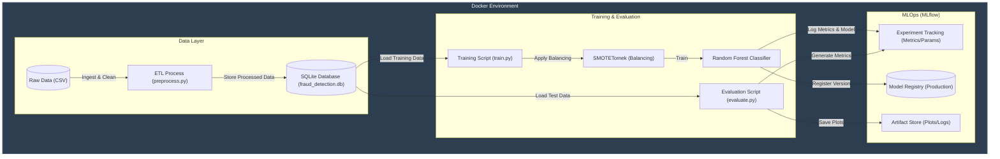
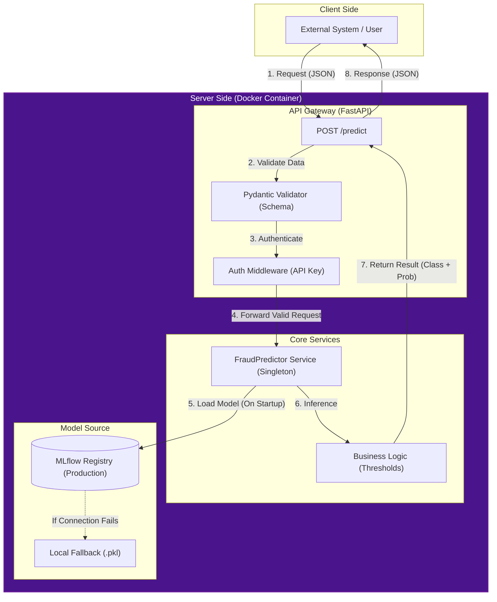

# CREDIT CARD FRAUD DETECTION / Detecção de Fraudes em Cartões de Crédito
DEVELOPED BY: _phmcasimiro_

MBA IN GENERATIVE ARTIFICIAL INTELLIGENCE - PCDF & IBMEC

## Software Engineering applied to Machine Learning | Engenharia de Software aplicada ao Aprendizado de Máquina

## Table of Contents | Sumário

1. [System Architecture Overview | Visão Geral da Arquitetura do Sistema](#system-architecture-overview--visão-geral-da-arquitetura-do-sistema)
2. [Data Pipeline | Pipeline de Dados](#pipeline-de-dados)
3. [Extraction & Ingestion | Extração e Ingestão](#1-extração-e-ingestão-de-dados)
4. [EDA | Análise Exploratória](#2-análise-exploratória-de-dados-eda)
5. [Preprocessing | Pré-processamento](#4-limpeza-e-pré-processamento-dos-dados)
6. [Training & MLOps | Treinamento e MLOps](#5-treinamento-e-mlops)
7. [Evaluation | Avaliação](#6-avaliação-do-modelo-validação-do-modelo)
8. [Infrastructure | Infraestrutura (Docker)](#7-infraestrutura-e-portabilidade-docker)
9. [Deploy | Deploy do Modelo](#8-deploy-do-modelo-produção)

### System Architecture Overview | Visão Geral da Arquitetura do Sistema

**1. User Interface Layer**

- Client/User: Makes HTTP POST requests to /predict endpoint

**1. Camada de Interface do Usuário**

- Cliente/Usuário: Faz requisições HTTP POST para o endpoint /predict

**2. API Layer (FastAPI)**

- FastAPI Application: Handles HTTP requests and responses

- Authentication: API key-based authentication

- Input Validation: Pydantic schemas for data validation


**2. Camada de API (FastAPI)**

- Aplicação FastAPI: Lida com requisições e respostas HTTP

- Autenticação: Autenticação baseada em chave de API

- Validação de Entrada: Esquemas Pydantic para validação de dados

**3. Application Core**

- Prediction Service: Orchestrates the prediction workflow

- Authentication: Secures API endpoints

- Data Validation: Ensures input data quality

**3. Núcleo da Aplicação**

- Serviço de Predição: Orquestra o fluxo de trabalho de predição

- Autenticação: Protege os endpoints da API

- Validação de Dados: Garante a qualidade dos dados de entrada

**4. Machine Learning Engine**

- Model Artifact: Serialized Random Forest model (.pkl file) and MLflow Model Registry.

- Data Preprocessing: Feature engineering and transformation

- Random Forest Model: Trained ML model for predictions

**4. Motor de Aprendizado de Máquina**

- Arquivo do Modelo: Modelo Random Forest serializado `model.pkl` e Registro de Modelos MLflow.

- Pré-processamento de Dados: Engenharia e transformação de recursos

- Modelo Random Forest: Modelo de aprendizado de máquina treinado para predições

**5. Data Pipeline (Offline)**

- **Data Storage:** SQLite database (`data/fraud_detection.db`) for structured storage.

- **Data Processing:** ETL pipeline reads from DB, cleans/transforms, and saves back to DB.

- **Model Training:** Offline training using data from SQLite.

**5. Pipeline de Dados (Offline)**

- **Armazenamento de Dados:** Banco de dados SQLite (`data/fraud_detection.db`) para armazenamento estruturado.

- **Processamento de Dados:** Pipeline ETL lê do banco, limpa/transforma e salva de volta no banco.

- **Treinamento do Modelo:** Treinamento offline usando dados do SQLite.


**6. Request Flow**

- **Request:** _User → POST /predict → FastAPI_

- **Validation:** _API validates input using Pydantic schemas_

- **Authentication:** _API key verification_

- **Prediction:** _Service loads model, preprocesses data, runs inference_

- **Response:** _Prediction result → JSON → User_

**6. Fluxo de Requisição**

- **Requisição:** _Usuário → POST /predict → FastAPI_

- **Validação:** _A API valida a entrada usando esquemas Pydantic_

- **Autenticação:** _Verificação da chave da API_

- **Previsão:** _O serviço carrega o modelo, pré-processa os dados e executa a inferência_

- **Resposta:** _Resultado da previsão → JSON → Usuário_


**7. Key Characteristics** 

- **Separation of Concerns:** _Clear separation between API, business logic, and ML components_

- **Offline Training:** _Model training is separate from serving_

- **Serialized Model:** _Uses pickle files for model persistence_

- **RESTful Design:** _Standard API patterns for ML serving_

**7. Características principais**

- **Separação de responsabilidades:** _Separação clara entre os componentes da API, da lógica de negócios e do aprendizado de máquina_

- **Treinamento offline:** _O treinamento do modelo é separado da sua disponibilização_

- **Modelo serializado:** _Usa arquivos pickle para persistência do modelo_

- **Design RESTful:** _Padrões de API padrão para disponibilização de aprendizado de máquina_

### 1. Data Pipeline & Training Architecture (Offline) | Arquitetura de Pipeline de Dados e Treinamento

This workflow covers the data lifecycle from ingestion to model registration, running inside a Dockerized environment.

Este fluxo de trabalho cobre o ciclo de vida dos dados, desde a ingestão até o registro do modelo, rodando dentro de um ambiente Dockerizado.



### 2. Deployment & Inference Architecture (Online) | Arquitetura de Deploy e Inferência

This workflow illustrates how the API serves predictions, abstracting the training complexity.

Este fluxo de trabalho ilustra como a API fornece predições, abstraindo a complexidade do treinamento.



---------------


### 1. Extração e Ingestão de Dados

#### 1.1 Extração e Ingestão de Dados
- O Script `download_data.py` baixa o dataset mais atualizado .

`script download_data.py`


### 2. Análise Exploratória de Dados (EDA)
- Antes de começar a codificar a API, é necessário entender os dados. 
- Verificar a correlação das variáveis `V1` a `V28` e a distribuição da variável alvo `Class`.

- O script `src/data/eda.py` implementa uma análise exploratória de dados (EDA).

- **OBS:** Gráficos para visualização foram feitos com as bibliotecas `seaborn` e `matplotlib` e salvos na pasta `artifacts/`.


#### **3.1 Distribuição da Variável Alvo `Class`:**

<p align="center">
  
</p>

- A variável `Class` possui dois valores: **0** (legítima) e **1** (fraude).

- Antes de treinar o modelo é essencial verificar o balanceamento/desbalanceamento das variáveis, então, usaremos um gráfico de barras (Distribuição de Classes) com este fim.

- Em fraudes, a classe "1" (fraude) costuma ser uma fração mínima, o que se traduz em uma barra enorme no 0 e uma quase invisível no 1.

- Em Machine Learning, isso significa que o dataset possui **Classes Desbalanceadas**. Caso o modelo seja treinado com dados severamente desbalanceados (menos de 0.2% dos dados são fraudes) aprenderá que "quase sempre não é fraude" e ignorará as fraudes reais.
    
- Explicando de outra forma, se o desbalanceamento não for tratado, o modelo de Random Forest aprenderá a sempre classificar como "0" (Transação Legítima), pois ele terá 99.8% de acurácia fazendo isso, mesmo falhando em detectar todas as fraudes (0.2%).
   
- **Importante:** Neste projeto focaremos na métrica **Recall** _(detalhes em: docs/Teoria&Conceitos.md)_ a fim de não ignorar nenhuma fraude, mesmo que isso gere alguns alarmes falsos (Falsos Positivos).


#### **3.2 Correlação das Variáveis `V1` a `V28`**

<p align="center">
  
</p>

- Neste dataset as variáveis `V1` a `V28` são resultado de um **PCA** (Principal Component Analysis), que transforma variáveis originais em novos componentes que são **independentes** entre si _(detalhes em: docs/Teoria&Conceitos.md)_.

- Logo, se fizermos uma matriz de correlação entre as variáveis, a correlação entre elas será próxima de zero (0).

- O Foco da Análise é a correlação das variáveis com a variável `Class/Fraude`, ou seja, descobrir quais variáveis `V` têm mais poder preditivo (influência) para determinar fraudes.

- O gráfico utiliza uma **escala de cores** para demonstrar a **força da relação entre as variáveis**.

- **Vermelho Forte** indica uma **correlação positiva perfeita (valor 1)**, isto é, quando uma variável aumenta, a outra também aumenta. Por isso há uma **linha vermelha na diagonal principal**, a qual representa a **correlação de uma variável consigo mesma**.

- **Azul Forte** indica uma **correlação negativa forte (valor -1)**, isto é, quando uma variável aumenta, a outra tende a diminuir.

- **Cores Claras/Neutras** Indicam **correlações fracas ou nulas (valor 0)**, ou seja, as variáveis apresentam comportamento independente entre si.

- O **Centro do gráfico** é marcado por cores neutras e azul clara, isto é, as variáveis não possuem correlação entre si em razão da técnica PCA aplicada ao conjunto de dados. Em outras palavras, as variáveis `V1` a `V28` têm correlação zero entre si (as células do mapa de calor fora da diagonal são neutras em sua maioria). A razão desse fenômeno é a aplicação da técnica **PCA** (Análise de Componentes Principais), uma técnica de engenharia de features que transforma dados correlacionados em componentes independentes _(detalhes em: docs/Teoria&Conceitos.md)_.

- A análise de variância é uma técnica estatística que permite avaliar a variação de uma variável em relação a outra variável. Em outras palavras, verifica-se quais variáveis `V1` a `V28` possuem maior variação quando a `Class/Fraude` é `1` e quando é `0`. As variáveis identificadas serão as mais importantes para o modelo de Random Forest.

- Ao analisar a última linha (ou coluna) da matriz, que mostra a correlação com a `Class/Fraude`, verificamos que as variáveis `V17`, `V14` e `V12` apresentam correlações negativas relativamente fortes com a `Class/Fraude`. 

### **4. LIMPEZA E PRÉ-PROCESSAMENTO DOS DADOS**

- A partir da identificação das variáveis críticas (V12, V14 e V17) e do desbalanceamento do dataset, a **limpeza e pré-processamento dos dados** garantem que o modelo de Random Forest seja treinado com dados de qualidade, evitando que o modelo seja enganado pelo ruído dos dados e que ele aprenda a classificar como "0" (Transação Legítima) e como "1" (Fraudes), mesmo que falhe em detectar todas as fraudes. 

#### **4.1 VERIFICAÇÃO DE INTEGRIDADE (DATA CLEANING)**

- O objetivo é garantir que todas as entradas estejam em uma escala comparável e que o modelo consiga "enxergar" a fraude apesar da escassez de exemplos de fraudes.

- **TRATAMENTO DE NULOS:** Confirmar que não existem valores NaN ou vazios. Havendo, decidir se aplicaremos uma técnica de imputação ou simplesmente removeremos as linhas com valores nulos.

- **REMOÇÃO DE DUPLICATAS:** Transações identicas podem causar overfitting, ou seja, o modelo decora o dado em vez de aprender o padrão, portanto, devem ser removidas. 

#### **4.1.1 VALIDAÇÃO DE INTEGRIDADE DE DADOS (PANDERA)**

- Visando garantir um pipeline de dados integro e evitar o processamento de dados corrompidos, foi implementada uma camada de validação (schema) usando a biblioteca **Pandera**.

- Se, no futuro, o Kaggle mudar o formato do arquivo (_creditcard.csv_) ou alguma coluna seja disponibilizada como texto em vez de número, isto é, houver qualquer tipo de mudança de formato ou tipo de dados, sem o Pandera, o script falharia de forma silenciosa ou poderia haver um erro matemático no treino.

- O uso do Pandera cria um "vigilante" que verifica o DataFrame, avalia e alerta alterações no dataset, garantindo a integridade estatística do modelo. O Pandera funciona como um contrato de dados, um schema, um molde ao qual o dado que entra no pipeline deve adequar seu formato e tipo. Caso contrário, o Pandera interrompe o processo imediatamente, evitando que o modelo aprenda padrões errados de dados inadequados (Evita o "Garbage In, Garbage Out").

- Foi definido um contrato/schema rígido `src/data/pandera_schemas.py` que verifica:
    - **Tipagem:** Garante que colunas V1 a V28, Time e Amount sejam sempre `float`.
    - **Regras de Negócio:** Verifica se a coluna `Amount` possui valores negativos (inválidos para transações).
    - **Consistência do Alvo:** Garante que a coluna `Class` contenha apenas os valores 0 ou 1.
    - **Contrato de Interface:** O strict=True garante que o modelo sempre receba as mesmas 30 variáveis de entrada, evitando erros de dimensão no futuro.

- Assim o pipeline segue o princípio de "Falha Rápida" (Fail-Fast), interrompendo o processo imediatamente caso o contrato de dados (schema) seja violado.


#### **4.2 ESCALONAMENTO DE ATRIBUTOS (FEATURE SCALING)**

- As variáveis `V1` a `V28` já estão em uma escala similar devido ao PCA. Contudo, as colunas `Time` e `Amount` possuem escalas completamente distintas (ex: `Amount` pode ir de 0 a 25.000).

- O Random Forest é menos sensível à escala do que modelos lineares, mas o escalonamento ajuda na convergência e na comparação de importância de features.

- Pode-se aplicar **RobustScaler** ou **StandardScaler** apenas nestas duas colunas para que fiquem na mesma "faixa" das variáveis V.

- **RobustScaler** é mais recomendado para dados com muitos outliers.

- **StandardScaler** é mais recomendado para dados com poucos outliers.

- Neste projeto foi aplicado o RobustScaler no script `src/data/preprocess.py`

#### **4.3 DIVISÃO DE CONJUNTOS (SPLITING)**

- O dataset foi dividido em dois conjuntos: **treino** e **teste** antes de qualquer técnica de balanceamento a fim de evitar o **Data Leakage** (vazamento de dados do teste para o treino).

- O conjunto de **treino** foi usado para treinar o modelo.

- O conjunto de **teste** foi usado para avaliar o desempenho do modelo.

- **Estratificação**: Foi usado o parâmetro `stratify=y` para garantir que a proporção de fraudes (minúscula) seja mantida nos conjuntos de treino e teste.

### 5. TREINAMENTO & MLOPS

O objetivo desta etapa é treinar o modelo para distinguir transações legítimas de fraudes e garantir o gerenciamento profissional do ciclo de vida desse modelo.

#### 5.1 **Fluxo do Pipeline de Treinamento**

O script `src/models/train.py` executa os seguintes passos:

1.  **Carregamento:** Leitura de `X_train.csv` e `y_train.csv`.
2.  **Balanceamento:** Aplicação de SMOTE (Geração de dados sintéticos).
3.  **Limpeza:** Aplicação de Tomek Links (Refinamento de fronteiras).
4.  **Treinamento:** Ajuste do Random Forest aos dados balanceados.
5.  **Registro:** Salvamento dos artefatos e métricas no MLflow.

#### 5.2 **Técnicas de Modelagem**

##### **A) Balanceamento de Dados (SMOTETomek)**
Como a classe de fraude é minoritária, foi utilizado um método híbrido:
-   **SMOTE (Oversampling):** Cria fraudes sintéticas interpolando exemplos existentes, ajudando o modelo a aprender a "região" da fraude.
-   **Tomek Links (Undersampling):** Remove exemplos da classe majoritária que estão muito próximos da classe minoritária, limpando a fronteira de decisão e reduzindo ruído.

##### **B) Algoritmo Random Forest**
Foi utilizado um **Ensemble** de **Árvores de Decisão**:
-   **Funcionamento:** Centenas de árvores "votam" na classificação. A maioria vence.
-   **Vantagens:** Alta robustez contra overfitting e capacidade de capturar padrões não-lineares complexos, típicos de fraudes.

#### 5.3 **MLOps com MLflow**

O MLflow foi implementado para elevar o nível de maturidade do projeto, garantindo rastreabilidade e governança.

##### **5.3.1 Arquitetura Implementada**
-   **Backend Store:** SQLite (`mlflow.db`) para metadados (rápido e leve).
-   **Artifact Store:** Diretório local (`mlruns/`) para modelos e gráficos.
-   **Model Registry:** Gerenciamento centralizado de versões de modelos.

##### **5.3.2 O Produto do Treinamento**

O resultado do treinamento gera dois artefatos principais:

1.  **Arquivo Binário (`model.pkl`)**:
    -   É o formato tradicional (legacy). Contém todos os cálculos e caminhos que as 100 árvores aprenderam serializados.
    -   Serve como **backup/fallback** caso o MLflow esteja indisponível.

2.  **Modelo Registrado no MLflow**:
    -   O modelo é salvo no formato padrão do MLflow e registrado no **Model Registry** com versionamento automático (ex: `FraudDetectionRandomForest/Version 1`).
    -   É o método **principal** de carregamento em produção, garantindo que a API sempre use a versão correta e aprovada.

Ambos contêm a mesma inteligência (as árvores de decisão treinadas), mas o registro no MLflow oferece governança e facilidade de deploy.

##### **5.3.2 Alteração de Modelo (Baseline vs Produção)**
Para garantir segurança na migração para MLOps:

1.  **Baseline (Legacy):** O antigo `model.pkl` foi registrado como `FraudDetectionBaseline` (v1).
2.  **Produção (Novo):** O novo modelo treinado foi registrado como `FraudDetectionRandomForest` e promovido para **Production**.
3.  **API Híbrida:** O `predictor.py` tenta carregar do MLflow Registry, mas se falhar usa o `model.pkl` local como fallback.

##### **5.3.3 Validação da Alteração dos Modelos**
Comparamos o modelo legado (`model.pkl`) com o novo modelo registrado `FraudDetectionRandomForest` no MLflow para garantir consistência:

| Métrica | Produção (.pkl) | MLflow Registry | Diferença |
| :--- | :--- | :--- | :--- |
| **Recall (Fraude)** | 0.8105 | 0.8105 | +0.0000 |
| **Precision (Fraude)** | 0.6063 | 0.6063 | +0.0000 |
| **F1-Score (Fraude)** | 0.6937 | 0.6937 | +0.0000 |
| **AUC-ROC** | 0.9786 | 0.9786 | +0.0000 |

**Conclusão:** Os modelos são idênticos. A migração foi bem-sucedida e segura.

### 6. **Avaliação e Validação do Modelo em Produção**

- Nesta etapa, o objetivo é avaliar o desempenho do modelo treinado com dados que não foram usados no treinamento (x_teste, y_teste).

#### **6.1 TAREFAS/ETAPAS (Automatizadas no `evaluate.py`)**

1.  **Execução do Script de Avaliação**
    -   O script `src/models/evaluate.py` é executado, carregando o modelo (do MLflow ou local) e os dados de teste.
    -   Todo o processo é rastreado automaticamente pelo MLflow.

2.  **Cálculo de Métricas**
    -   São calculadas as métricas: **Precision**, **Recall**, **F1-Score**, **Acurácia** e **AUC-ROC**.
    -   Os valores são registrados no MLflow para comparação histórica.

3.  **Geração de Artefatos Visuais** 
    
    -   **Matriz de Confusão:** Salva como imagem e registrada no MLflow.
    -   **Curva ROC:** Gráfico da performance do classificador, também salvo e registrado.
    -   **Relatório Técnico:** Arquivo de texto com o detalhamento das métricas. 
    - **Armazenamento:** `artifacts/evaluation`

#### **6.2 CONSIDERAÇÕES SOBRE AVALIAÇÃO DE FRAUDES**

**LEGENDA:** 

`VN = Verdadeiro Negativo`

`FP = Falso Positivo`

`FN = Falso Negativo`

`VP = Verdadeiro Positivo`

- **ACCURACY**: 

    - Fórmula: `(VN+VP)/(VN+VP+FP+FN)`

    - Percentual de acertos totais (tanto de fraudes quanto de legítimas).

    - Não é a melhor métrica para avaliar modelos construídos a partir de dados desbalanceados porque pode levar a um alto número de falsos negativos.

    - Por exemplo, se 99,8% das transações são legítimas, um modelo mal treinado e mal avaliado dirá que "NUNCA É FRAUDE" mesmo com 99,8% de acurácia, ou seja, terá um alto número de falsos negativos, isto é, o modelo erra em detectar fraudes.

- **PRECISION** 

    - Fórmula: `VP/(VP+FP)`

    - Responde à pergunta: "De todas as vezes que o modelo deu alerta de fraude, quantas eram fraudes reais?".

    - O objetivo desta métrica é reduzir Falsos Positivos, ou seja, evitar que o banco bloqueie o cartão de um cliente honesto por engano.

    - Exemplo: Uma precisão de 0.90 significa que, a cada 10 alertas de bloqueio, 9 eram realmente fraudes e 1 foi um alarme falso.    
    - Importância: Fundamental para medir a "irritação" gerada ao cliente legítimo.

- **RECALL**

    - Fórmula: `VP/(VP+FN)`

    - Responde à pergunta: "De todas as fraudes que realmente ocorreram, quantas o modelo conseguiu detectar?".

    - O objetivo desta métrica é reduzir Falsos Negativos, ou seja, evitar que o dinheiro do banco/cliente seja roubado.

    - Exemplo: Um recall de 0.90 significa que, de cada 10 fraudes que aconteceram, o modelo detectou 9 e deixou passar 1.

    - Importância: É a métrica de segurança. O aumento do Recall tende a baixar a Precision (mais bloqueios preventivos), exigindo um ponto de equilíbrio.

- **F1-SCORE** 

    - Fórmula: `2*(Precision * Recall)/(Precision + Recall)`

    - Média Harmônica entre Precision e Recall

    - Busca equilibrar Precision e Recall. Se o Recall for excelente (1.0) mas a Precision for péssima (0.1), o F1-Score será baixo. 

    - É a métrica única mais utilizada para comparar modelos em datasets desbalanceados.

- **AUC-ROC** 

    - Fórmula: `Área sob a curva ROC`

    - A curva ROC plota a "Taxa de Verdadeiros Positivos" contra a "Taxa de Falsos Positivos" para diferentes limiares de decisão do modelo.

    - Sabendo que a área sob a Curva ROC varia entre 0 e 1, um valor de 1 indica um modelo perfeito (todas as fraudes são detectadas e nenhum legítimo é bloqueado), um valor de 0.5 indica um modelo aleatório e um valor de 0 indica um modelo completamente incapaz de distinguir fraude de transação legítima, chegando a inverter as predições.

    - Considerando o Modelo de Detecção de Fraude deste projeto, uma AUC-ROC de 0.95 indicaria que o modelo tem uma capacidade muito alta de distinguir o que é fraude do que é legítimo, independentemente da proporção de classes. Já um AUC-ROC de 0.5 indicaria um modelo aleatório.


**IMPORTANTE:** RECALL é considerado uma métrica primária de segurança (pois queremos pegar o ladrão), enquanto a PRECISION é a métrica de "qualidade de atendimento" (não irritar o cliente). 


#### RESULTADOS

- **RELATÓRIO DE MÉTRICAS (Classe 1 Fraude):** 
    - **Recall (0.81):** Significa que de cada 100 fraudes reais, seu modelo detectou 81. Considerando que este é um primeiro modelo, construído com dados desbalanceados, esse resultado atingiu a expectativa.

    - **Precision (0.61):** Significa que quando o modelo diz "fraude", ele está certo em 61% das vezes. Os outros 39% são falsos positivos. Para bancos, este é um percentual aceitável, pois é preferível verificar uma transação legítima do que deixar uma fraude passar. Contudo, há de ser melhorado porque cada transação legítima bloqueada é um incômodo para o cliente.

    - **F1-Score (0.69):** É o equilíbrio entre os dois anteriores. O valor alcançado, próximo de 0.70, é um ponto de partida aceitável para um sistema de detecção de anomalias que utiliza um dataset muito desbalanceado.

    - **AUC-ROC (0.9786):** Este é o melhor resultado entre as métricas utilizadas, porque indica que o modelo possui uma capacidade excelente de separar as classes. Analisando comparativamente com os erros de Precision, Recall e F1-Score, estes últimos podem ser melhorados se ajustado o limiar (threshold) de decisão sobre a classificação de fraude.

- **MATRIZ DE CONFUSÃO:** 
    
    - A Matriz de Confusão permite visualizar onde o modelo acertou e onde e como ele errou.

    - **Verdadeiros Negativos (Superior Esquerdo - 56601):** 
    - Representa as transações legítimas que o modelo classificou corretamente como legítimas. Como esperado, é o maior volume de dados.

    - **Falsos Positivos (Superior Direito - 50):** 
    - Estes são os "Alarmes Falsos". O modelo previu fraude (1), mas a transação era legítima (0). No seu caso, são apenas 50 casos em mais de 56 mil, o que indica uma alta Precisão.

    - **Falsos Negativos (Inferior Esquerdo - 18):** 
    - São 18 fraudes que ocorreram na vida real, mas o modelo classificou como transação normal. O objetivo é reduzir esse número ao máximo para evitar prejuízo financeiro.

    - **Verdadeiros Positivos (Inferior Direito - 77):** 
    - São fraudes reais que o modelo conseguiu detectar com sucesso.

    - **Conclusão da Matriz:** O modelo conseguiu capturar a grande maioria das fraudes (77 de 95 totais no teste), mantendo um número muito baixo de clientes legítimos incomodados por alarmes falsos.

<p align="center">
  
</p>

- **CURVA ROC:**

    - A Curva ROC (Receiver Operating Characteristic) mostra a capacidade do modelo de distinguir entre as duas classes (Fraude vs. Legítima) conforme alteramos o "limiar" de decisão.

    - **Linha Azul (Modelo):** Quanto mais próxima ela estiver do canto superior esquerdo, melhor. Note que ela sobe quase verticalmente no início, o que indica que o modelo consegue identificar muitos Verdadeiros Positivos (Recall) sem aumentar drasticamente os Falsos Positivos.

    - **Linha Tracejada Preta:** Representa um modelo puramente aleatório (como jogar uma moeda). Como a linha azul está muito acima, significa que o modelo é muito superior ao acaso.

    - **Valor AUC = 0.9786:** A área sob a curva (AUC) é de quase 98%. Significa que se analisarmos, aleatoriamente, uma transação fraudulenta e uma legítima, há 97,86% de chance do modelo atribuir uma pontuação de risco maior para a fraude.

<p align="center">
  
</p>

### 7. **INFRAESTRUTURA E PORTABILIDADE (DOCKER)**

- Para garantir que o projeto seja executado de forma idêntica em qualquer ambiente (desenvolvimento, teste ou produção), foi implementada a conteinerização utilizando **Docker**, isto é, foi criada uma imagem do projeto que pode ser executada em qualquer ambiente que suporte Docker, eliminando o problema do "na minha máquina funciona" e isolando todas as dependências e configurações.

- **Por que o Docker nesta etapa do projeto?**

- Considerando o Fluxo de MLOps, começamos pela **Experimentação**, que inclui experimentação, construção e avaliação do modelo de ML (Etapas 1 a 6). Seguimos para o Empacotamento (Etapa 7) e, por fim, para a Disponibilização como Serviço (Etapa 8).

- **IMPLEMENTAÇÃO DO DOCKER:**
    - **Imagem Base:** Utilização do `python:3.12-slim`.
    - **Isolamento de Ambiente:** Gerenciamento automático de dependências via `requirements.txt`.
    - **Configuração de PYTHONPATH:** Padronização dos caminhos de importação, resolvendo conflitos de módulos entre scripts.
    - **Reprodutibilidade:** Garantia de que o pré-processamento, treino e avaliação ocorram sob as mesmas versões de bibliotecas (Pandas, Scikit-Learn, Pandera, etc).

- **CRIAR ARQUIVO `.dockerignore`**

```bash
venv/
__pycache__/
*.pyc
.git/
.env
logs/*.log
```

- **CRIAR ARQUIVO `dockerfile`**

```bash
# Dockerfile
# Criado por phmcasimiro
# Data: 2026-01-09

# 1. Imagem base oficial do Python
FROM python:3.12-slim

# 2. Diretório de trabalho
WORKDIR /app

# 3. Configurações de ambiente
ENV PYTHONDONTWRITEBYTECODE 1
ENV PYTHONUNBUFFERED 1
ENV PYTHONPATH=/app

# 4. Instalar ferramentas de compilação (necessárias para o imbalanced-learn)
RUN apt-get update && apt-get install -y --no-install-recommends \
    build-essential \
    && rm -rf /var/lib/apt/lists/*

# 5. Instalar dependências (aproveitando o cache do Docker)
COPY requirements.txt .
RUN pip install --no-cache-dir -r requirements.txt

# 6. Copiar o código do projeto
COPY . .

# 7. Comando padrão (abre um terminal)
CMD ["bash"]
```

- **EXECUTAR O COMANDO `docker build`**

```bash
docker build -t fraud-detection-app .
```

- **EXECUTAR O COMANDO `docker run`**

```bash
docker run -it fraud-detection-app
```

- Ao executar o comando acima, inicia-se um container baseado na imagem fraud-detection-app construída.

- Ao verificar o terminal, verá que o container foi iniciado e está rodando. A linha de comando apresentará: **root@567e69a3149f:/app#**

- **CRIAR ARQUIVO `docker-compose.yml`**

```bash
# docker-compose.yml
# Criado por phmcasimiro
# Data: 2026-01-09

version: '3.8'

services:
  app:
    build: . # Indica ao Compose para usar o Dockerfile da pasta atual.

    container_name: fraud_detection_container # Nome do container.

    # Sincronização em tempo real (Volumes)
    volumes:
      - .:/app # O ponto (.) é a máquina local, e /app é o container. Agora, qualquer vírgula atualizada no VS Code/Editor será refletida instantaneamente dentro do container Docker.

    stdin_open: true # Mantém o container aberto para comandos interativos

    tty: true # Mantém o container aberto para comandos interativos

    environment:
      - PYTHONPATH=/app
      - PYTHONDONTWRITEBYTECODE=1
      - PYTHONUNBUFFERED=1
```


### 7.1 **Considerações sobre o Docker:**
 
- Quando executamos o comando **`docker build`**, o Docker olha para o diretório _".../FraudDetection"_ e copia tudo o que está lá para dentro de uma `Imagem` estática.
- Se o arquivo _src/models/evaluate.py_ for modificado depois disso, o Docker não vai reconhecer essa alteração, pois ele olha para a `Imagem` já construída, não para o seu diretório _"src"_ em tempo real.
- **Conclusão:** Para atualizar o código dentro do Docker, temos dois caminhos:
        1.  Rodar **`docker build`** novamente para "tirar uma nova foto" (recriar a imagem).
        2.  Utilizar o **`docker-compose`**, que configuramos para criar um "espelho" (Volume) entre sua pasta local e a pasta _"/app"_ do container. Assim, qualquer alteração no seu código reflete instantaneamente lá dentro.

- **Resumo Conceitual:**
    - **Dockerfile:** É o arquivo de texto com as instruções passo a passo.
    - **Docker Image:** É o resultado do `build`. Um arquivo estático e imutável.
    - **Docker Container:** É a execução da imagem `run`. É possível executar vários containers a partir da mesma imagem.
    - **Docker Compose:** `docker-compose.yml` é o arquivo que coordena os containers. Garante que o app, o banco de dados e outros serviços estejam em execução e conectados corretamente.

### 7.2 **Comandos Docker**

#### 7.2.1 **Construção (Build)**
- `docker build -t fraud-detection-app .`
    - Cria a **Imagem** (a "foto" estática) do seu projeto a partir do Dockerfile.

#### 7.2.2 **Execução (Run) e Parada (Down)**
- `docker run -it fraud-detection-app`
    - Cria e inicia um container isolado baseado na imagem. **Não** tem sincronização de arquivos (se mudar o código, ele não vê).
- `docker-compose down`: 
    - Para e remove o container.

- `docker-compose up --build -d`
    - Constrói a imagem (se tiver mudanças), cria o container com as configurações do [docker-compose.yml](cci:7://file:///home/pedro/Documentos/Projects/FraudDetection/docker-compose.yml:0:0-0:0) (incluindo o espelho/volume) e deixa rodando em segundo plano.

#### 7.2.3 **Gerenciamento**
- `docker images`
    - Lista todas as imagens salvas no seu computador.
- `docker rmi <image_id>`
    - Apaga uma imagem do disco.
- `docker ps`
    - Lista os containers que estão rodando agora.
- `docker ps -a`
    - Lista todos os containers (inclusive os parados/desligados).
- `docker stop <container_id>`
    - Desliga um container suavemente.
- `docker rm <container_id>`
    - Apaga um container parado.

#### 7.2.4 **Logs**
- `docker logs <container_id>`
    - Exibe os logs de um container.
- `docker-compose logs -f app`
    - Exibe os logs do container "app" em tempo real.


```bash
(venv) pedro@HP-246-G6-PC:~/Documentos/Projects/FraudDetection$ docker images
REPOSITORY            TAG       IMAGE ID       CREATED        SIZE
fraud-detection-app   latest    689e660d5481   12 hours ago   1.42GB

(venv) pedro@HP-246-G6-PC:~/Documentos/Projects/FraudDetection$ docker ps -a
CONTAINER ID   IMAGE                 COMMAND   CREATED             STATUS                         PORTS     NAMES
1919787ad322   fraud-detection-app   "bash"    About an hour ago   Exited (0) About an hour ago             modest_ellis
567e69a3149f   fraud-detection-app   "bash"    12 hours ago        Exited (130) 12 hours ago                cranky_pascal

(venv) pedro@HP-246-G6-PC:~/Documentos/Projects/FraudDetection$ docker ps
CONTAINER ID   IMAGE     COMMAND   CREATED   STATUS    PORTS     NAMES

```

### 8. **Deploy do Modelo (Produção)**

- No ponto de **Deploy** há uma transição do trabalho de um Cientista de Dados para um Engenheiro de Machine Learning. Nesta etapa, transformaremos o modelo estático `model.pkl` em um serviço web acessível (API), ou seja, colocaremos o modelo de **desenvolvimento** em **produção**, permitindo que sistemas externos (bancos) enviem transações e recebam previsões de fraude em tempo real.

- Sem o Deploy, o modelo de ML é apenas um arquivo inútil. Com o Deploy, o modelo se torna um serviço web acessível via API.

#### 8.1 Panorama Geral do Deploy

**1 - Contrato/Schemas Pydantic**
    - Arquivo `src/api/schemas.py` garante que a API só receba dados no formato esperado, evitando erros devido a dados inválidos. 

**2 - Services**
    - Arquivo `src/models/predictor.py` implementa a lógica de negócio (predição de fraude). Este script é uma interface entre as chamadas da internet na API e o modelo Estatístico de machine learning.

**3 - FastAPI**
    - Arquivo `src/api/main.py` implementa a API utilizando o framework **FastAPI**. É o servidor que fica "ouvindo" a internet. Quando recebe uma requisição de predição, ele valida com o Schema e chama a função de predição.

**4 - Servidor de Aplicação (Uvicorn)**
    - O FastAPI cria a lógica, mas o **Uvicorn** é o servidor ASGI de alta performance que gerencia as conexões de rede, processos paralelos (workers) e garante que a API aguente milhares de requisições simultâneas.

**5 - Docker**
    - Atualizar a `Dockerfile` e `docker-compose.yml` para expor a porta da API (ex: 8000).
    - Garantir que o serviço suba automaticamente pronto para receber requisições.

**6 - CI/CD (Testes Automatizados)**
    - Implementar testes unitários e de integração com **pytest**.
    - Garantir que a API responda corretamente a dados válidos e trate erros para dados inválidos (ex: valores negativos) antes de adicionar camadas de segurança.

**7 - Segurança e Autenticação**
    - Implementação de barreiras de segurança (como API Keys ou OAuth2) para garantir que apenas clientes autorizados (ex: o sistema do banco) possam enviar transações para análise, protegendo o modelo contra uso indevido.

#### 8.2 Exemplo API FraudDetection

- Se um sistema bancário enviar um JSON para a API:

```json
{ "Time": 1024, "V1": -1.2, ..., "Amount": 5000.0 }
```

- A API valida os dados com o Schema, chama a função de predição e retorna um JSON com o resultado:

```json
{ "is_fraud": 1, "probability": 0.98, "status": "ALTO RISCO" }
```

#### 8.3 - Schemas (Pydantic)

- O Pydantic é uma biblioteca que ajuda a validar e converter dados em Python. Ele é comumente usado para validar dados de entrada e saída em APIs.

- O arquivo `src/api/schemas.py` define os contratos de entrada e saída da API. Em APIs, o cliente e o servidor precisam concordar exatamente com o formato dos dados ou nada funciona.

- ***TransactionInput***: Define o formato de entrada da API.
- ***PredictionOutput***: Define o formato de saída da API.
    - Herança `BaseModel`: Ao herdar de BaseModel, o Pydantic automaticamente transforma o JSON que chega na API em um objeto Python e valida os tipos de dados.
    - `Field`: Ajuda a documentar os dados e fornece exemplos.
    - `...`: Indica que o campo é obrigatório.
    - `description`: Ajuda a documentar os dados e fornece exemplos.
    - `example`: Ajuda a documentar os dados e fornece exemplos.
    - `ge`: Indica que o campo deve ser maior ou igual a um valor.
    - `nullable`: Indica que o campo pode ser nulo.

```python
from pydantic import BaseModel, Field
from typing import Optional

class TransactionInput(BaseModel):
    """
    Schema de entrada para uma única transação de cartão de crédito.
    Inclui as 30 features que o modelo Random Forest espera.
    """
    Time: float = Field(..., description="Segundos decorridos desde a primeira transação", example=406.0)
    V1: float = Field(..., example=-1.359807)
    V2: float = Field(..., example=-0.072781)
    V3: float = Field(..., example=2.536347)
    V4: float = Field(..., example=1.378155)
    V5: float = Field(..., example=-0.338321)
    V6: float = Field(..., example=0.462388)
    V7: float = Field(..., example=0.239599)
    V8: float = Field(..., example=0.098698)
    V9: float = Field(..., example=0.363787)
    V10: float = Field(..., example=0.090794)
    V11: float = Field(..., example=-0.551600)
    V12: float = Field(..., example=-0.617801)
    V13: float = Field(..., example=-0.991390)
    V14: float = Field(..., example=-0.311169)
    V15: float = Field(..., example=1.468177)
    V16: float = Field(..., example=-0.470401)
    V17: float = Field(..., example=0.207971)
    V18: float = Field(..., example=0.025791)
    V19: float = Field(..., example=0.403993)
    V20: float = Field(..., example=0.251412)
    V21: float = Field(..., example=-0.018307)
    V22: float = Field(..., example=0.277838)
    V23: float = Field(..., example=-0.110474)
    V24: float = Field(..., example=0.066928)
    V25: float = Field(..., example=0.128539)
    V26: float = Field(..., example=-0.189115)
    V27: float = Field(..., example=0.133558)
    V28: float = Field(..., example=-0.021053)
    Amount: float = Field(..., ge=0, description="Valor da transação (deve ser >= 0)", example=149.62)

class PredictionOutput(BaseModel):
    """
    Schema de saída da API com o resultado da classificação.
    """
    is_fraud: int = Field(..., description="0 para Legítima, 1 para Fraude")
    probability: float = Field(..., description="Probabilidade da transação ser fraude")
    status: str = Field(..., description="Mensagem descritiva do resultado")
```

##### Resumo do Fluxo: 
JSON Externo ➡️ TransactionInput (Validação) ➡️ Predictor (ML) ➡️ PredictionOutput (Resposta)

#### 8.4 Serviço de Predição

- O script `src/models/predictor.py` contém a lógica de predição. Seu objetivo é carregar o modelo de detecção de fraude uma única vez e oferecer uma função que recebe os dados da API e devolve a classficação.

##### 8.4.1 Considerações sobre o script de Predição

- **Carregamento Único (In-Memory)**: O ***joblib.load*** está dentro do ***__init__*** a fim de que o modelo seja carregado uma única vez na RAM, quando a API for implementada em produção. Isso evita carregar o modelo do disco a cada nova transação, o que levaria muito tempo. 

- **model_dump()**: Esse método do Pydantic transforma o objeto JSON que a API recebeu em um dicionário Python puro, que o Pandas aceita facilmente para criar o DataFrame.

- **Probabilidade vs Classe**: O modelo de detecção de fraude (Random Forest) não classifica em 0 ou 1, legítima ou fraude. Ele gera um percentual de probabilidade de fraude, por exemplo, _"92% de certeza que é fraude"_. Para sistemas financeiros, esse número é mais valioso que o 0 ou 1 seco.

```python
# predictor.py
# Arquivo com a lógica de predição
# Elaborado por phmcasimiro
# Data: 10/01/2026


import joblib
import pandas as pd
import logging
from src.schemas.schemas import TransactionInput

# Configurar logs para rastrear o que acontece na predição
logger = logging.getLogger(__name__)

class FraudPredictor:
    def __init__(self, model_path: str = "artifacts/models/model.pkl"):
        """
        Ao iniciar, o serviço carrega o modelo para a memória.
        Isso evita ler o arquivo do disco a cada nova transação.
        """
        try:
            self.model = joblib.load(model_path)
            logger.info(f" Modelo carregado com sucesso de: {model_path}")
        except Exception as e:
            logger.error(f"Erro ao carregar o modelo: {e}")
            raise e

    def predict(self, data: TransactionInput):
        """
        Recebe os dados validados pelo Pydantic, transforma em DataFrame
        e solicita a predição ao Random Forest.
        """
        # 1. Converter o objeto Pydantic em um dicionário e depois em DataFrame
        df_input = pd.DataFrame([data.model_dump()])

        # 2. Realizar a predição de classe (0 ou 1)
        prediction = self.model.predict(df_input)[0] # 0 (Legítima) ou 1 (Fraude)

        # 3. Calcular a probabilidade de ser fraude
        # [0, 1] -> [Legítima, Fraude] -> Utilizou-se o índice 1 que é a probabilidade de ser fraude
        probability = self.model.predict_proba(df_input)[0][1]

        # 4. Definir uma mensagem de status baseada na probabilidade
        if probability > 0.8:
            status = "Risco Crítico: Bloqueio Imediato"
        elif probability > 0.5:
            status = "Risco Moderado: Requer Análise Humana"
        else:
            status = "Transação Aprovada"

        return {
            "is_fraud": int(prediction),
            "probability": float(probability),
            "status": status
        }

# Instância única (Singleton) para ser usada pela API
predictor = FraudPredictor()
```
#### 8.5 API (FastAPI)

- **O que é uma API?**
    - API (Application Programming Interface) é um conjunto de regras que permite que diferentes softwares se comuniquem. No caso desta API, é a interface que viabiliza um site ou aplicativo enviar dados de uma transação e receber resposta se a transação é fraude ou legítima, sem precisar conhecer o código complexo do modelo.

- **O que é o FastAPI?**
    - É um framework moderno e de alta performance para construção de APIs em Python. É extremamente rápido (comparável a NodeJS e Go), fácil de usar e gera automaticamente a documentação interativa (Swagger UI), o que facilita os testes.

- **O que é o Uvicorn?**
    - Uvicorn é um servidor ASGI (Asynchronous Server Gateway Interface) para aplicações FastAPI. Ele é responsável por receber as requisições HTTP e enviar as respostas para o cliente.

- **Implementação da API (FastAPI) e do Servidor de Aplicações (Uvicorn)?**
    - A API (FastAPI) foi configurada no arquivo `src/api/main.py`.
    - O Servidor de Aplicação (Uvicorn) foi configurado no arquivo `src/api/main.py`, mas iniciado dentro do container Docker no arquivo `docker-compose.yml` com Hot-Reload ativado.

```python
# src/api/main.py
# API Principal usando FastAPI
# Elaborado por phmcasimiro
# Data: 10/01/2026

from fastapi import FastAPI, HTTPException
from src.schemas.schemas import TransactionInput, PredictionOutput
from src.services.predictor import predictor
import logging

# Configurar Logs da API
logging.basicConfig(level=logging.INFO)
logger = logging.getLogger("api")

# Inicializar App
app = FastAPI(
    title="API Detecção de Fraudes",
    description="API para detecção de fraudes em transações de cartão de crédito.",
    version="1.0.0",
)
# Endpoint de Health Check
@app.get("/", tags=["Health Check"])
def read_root():
    """
    Endpoint raiz para verificar se a API está online.
    """
    return {"message": "API Detecção de Fraudes está online!", "status": "online"}

# Endpoint de Predição
@app.post("/predict", response_model=PredictionOutput, tags=["Prediction"])
def predict_fraud(transaction: TransactionInput):
    """
    Endpoint para predição de fraude.
    Recebe dados da transação e retorna probabilidade de ser fraude.
    """
    try:
        logger.info("Recebendo nova transação para análise.")
        result = predictor.predict(transaction)
        logger.info(f"Predição realizada com sucesso: {result['status']}")
        return result
    except Exception as e:
        logger.error(f"Erro durante a predição: {str(e)}")
        raise HTTPException(
            status_code=500, detail=f"Erro interno no servidor: {str(e)}"
        )

```
- **Configuração do Docker**
    - O Docker foi configurado no arquivo `docker-compose.yml`.
    - O Uvicorn foi configurado no arquivo `src/api/main.py`, mas iniciado dentro do container Docker no arquivo `docker-compose.yml` com Hot-Reload ativado.

```bash
# docker-compose.yml
# Criado por phmcasimiro
# Data: 2026-01-09

version: '3.8'

services:
  app:
    build: . # Indica ao Compose para usar o Dockerfile da pasta atual.

    container_name: fraud_detection_container # Nome do container.

    # Sincronização em tempo real (Volumes)
    #Atualizações nos diretórios e scripts serão refletida instantaneamente no container Docker.
    volumes:
      - .:/app # O ponto (.) é máquina local, e /app é o container. 
      
    stdin_open: true # Mantém o container aberto para comandos interativos

    tty: true # Mantém o container aberto para comandos interativos

    # Expor a porta da API (Host:Container)
    ports:
      - "8000:8000"

    # Comando para iniciar a API com Uvicorn (Reload ativado para dev)
    command: uvicorn src.api.main:app --host 0.0.0.0 --port 8000 --reload

    environment:
      - PYTHONPATH=/app
      - PYTHONDONTWRITEBYTECODE=1
      - PYTHONUNBUFFERED=1

```

- **Como subir a API?**
    - Com o `docker-compose.yml` configurado, basta rodar:
    ```bash
    docker-compose up --build -d
    ```
    - Isso constrói a imagem e inicia o servidor Uvicorn na porta 8000.

- **Visualizando Logs:**
    - Para ver o que está acontecendo (ex: "Recebendo nova transação..."), use:
    ```bash
    docker-compose logs -f app
    ```
    - O `-f` (follow) faz com que os logs apareçam em tempo real.

- **Testar o Reload Automático (Hot-Reload):**
    - O Docker foi configurado com um "espelho" (Volume). Caso o arquivo `src/api/main.py` seja editado e salvo, por exemplo, com uma alteração da mensagem de status de `"online"` para `"rodando"` (linha 27), o terminal de logs mostrará que o Uvicorn detecta a mudança e reinicia a API automaticamente, mostrando o log no terminal.

- **Sair dos Logs:**
    - Pressione `Ctrl + C`. 
    - Para de exibir os logs, mas o container continua rodando em segundo plano.

- **Testar com Swagger UI:**
    1.  Acesse `http://localhost:8000/docs` no seu navegador.
    2.  Você verá a documentação automática.
    3.  Clique no endpoint `POST /predict` -> `Try it out`.
    4.  Edite o JSON de exemplo e clique em `Execute`.
    5.  A API processará os dados e retornará a previsão (fraude ou legítima) logo abaixo. 


#### 8.6 CI/CD (Testes Automatizados)

- **Panorama Geral sobre CI/CD**
    - De acordo com as boas práticas de desenvolvimento atuais, não basta apenas escrever código, é necessário garantir que o software esteja funcionando a cada edição, na sua conclusão e em cada alteração. O CI/CD (Continuous Integration/Continuous Delivery) é a esteira automática que valida e entrega do código.
    - No contexto de Machine Learning (MLOps), isso se torna ainda mais crítico porque há três variáveis que podem sofrer mudanças: Código, Dados e Modelo.
- **CI (Continuous Integration - Integração Contínua):** É a prática de integrar mudanças de código frequentemente. A cada "Save" ou "Push" para o repositório, um robô roda todos os testes automaticamente. Se algo não funcionar como planejado, o desenvolvedor é recebe um warning na hora.
- **CD (Continuous Delivery/Deployment - Entrega Contínua):** É a automação do deploy. Se os testes do CI passarem, o sistema atualiza a API em produção automaticamente, sem intervenção humana.
- **Testes Automatizados:** São scripts que "fingem" ser um usuário para verificar se o sistema está funcionando.
    - *Unitários:* Testam uma função isolada (ex: "A função de soma retorna 4 para 2+2?").
    - *Integração:* Testam se as partes conversam bem (ex: "A API recebe o JSON e o Modelo devolve a predição?").

- **A Importância para Engenharia de Software em ML**
    1.  **Confiabilidade:** Evita que um erro bobo de código (bug) derrube o sistema de detecção de fraudes em produção, o que poderia causar prejuízo financeiro real.
    2.  **Agilidade:** Permite que o Cientista de Dados melhore o modelo e coloque em produção em minutos, com segurança, ou seja, sem intervenção humana.
    3.  **Documentação Viva:** Os testes devem simular exatamente como o sistema deve se comportar. Se o teste espera receber um `float`, isso pode ser interpretado como uma documentação de que o campo deve ser do tipo `float`.

##### 8.6.1 Testes Automatizados

- O script de testes está em `tests/test_api.py`
- Utiliza a biblioteca `pytest` e o `TestClient` do FastAPI para simular requisições HTTP e testar a API

- `TestClient(app)`: Neste trecho o FastAPI cria um "navegador virtual" (client), que permite enviar requisições para a API (app) sem precisar executar o servidor (sem uvicorn, sem docker), ou seja, é uma operação simulada na memória, tornando o teste ultra-rápido.

```python
from fastapi.testclient import TestClient
from src.api.main import app

# Cliente de teste do FastAPI (simula requisições HTTP)
client = TestClient(app)
```

- `test_health_check():` Testa se a API está funcionando (online).

```python
def test_health_check():
    """
    Testa se o endpoint raiz (/) retorna 200 OK e status online.
    """
    response = client.get("/")  # Simula alguém acessando http://localhost:8000/
    
    # Assert (Afirmação): Espera um código de status 200 (OK), se não, o teste falha
    assert response.status_code == 200  
    
    # Verificar se o JSON retornado é EXATAMENTE o que esperamos
    assert response.json() == {
        "message": "API Detecção de Fraudes está online!",
        "status": "online",
    }
```

- `test_predict_legitimate_transaction():` Testa uma transação legítima que deve ser processada com sucesso (200 OK).

```python
def test_predict_legitimate_transaction():
    # Payload de teste (transação normal)
    payload = {
        "Time": 406.0,
        "V1": -1.359807,
        "V2": -0.072781,
        "V3": 2.536347,
        "V4": 1.378155,
        "V5": -0.338321,
        "V6": 0.462388,
        "V7": 0.239599,
        "V8": 0.098698,
        "V9": 0.363787,
        "V10": 0.090794,
        "V11": -0.551600,
        "V12": -0.617801,
        "V13": -0.991390,
        "V14": -0.311169,
        "V15": 1.468177,
        "V16": -0.470401,
        "V17": 0.207971,
        "V18": 0.025791,
        "V19": 0.403993,
        "V20": 0.251412,
        "V21": -0.018307,
        "V22": 0.277838,
        "V23": -0.110474,
        "V24": 0.066928,
        "V25": 0.128539,
        "V26": -0.189115,
        "V27": 0.133558,
        "V28": -0.021053,
        "Amount": 149.62,
    }
    
    # Simular um POST para /predict enviando o JSON
    response = client.post("/predict", json=payload)
    
    # Verificar se a resposta é 200 OK
    assert response.status_code == 200
    data = response.json()
    
    # A resposta deve conter os campos is_fraud, probability e status
    assert "is_fraud" in data
    assert "probability" in data
    assert "status" in data
    
    # Garantir que a probabilidade seja um número decimal (float)
    assert isinstance(data["probability"], float)
```


- `test_predict_invalid_amount():` Testa o funcionamento do contrato Pydantic (src/api/schemas.py), isto é, se a API retorna um erro (422 Unprocessable Entity) quando recebe valores inválidos em um objeto JSON encaminhado por um request/consulta de um sistema externo.

```python
def test_predict_invalid_amount():
    payload = {
        "Time": 0.0,
        "V1": 0.0,
        "V2": 0.0,
        "V3": 0.0,
        "V4": 0.0,
        "V5": 0.0,
        "V6": 0.0,
        "V7": 0.0,
        "V8": 0.0,
        "V9": 0.0,
        "V10": 0.0,
        "V11": 0.0,
        "V12": 0.0,
        "V13": 0.0,
        "V14": 0.0,
        "V15": 0.0,
        "V16": 0.0,
        "V17": 0.0,
        "V18": 0.0,
        "V19": 0.0,
        "V20": 0.0,
        "V21": 0.0,
        "V22": 0.0,
        "V23": 0.0,
        "V24": 0.0,
        "V25": 0.0,
        "V26": 0.0,
        "V27": 0.0,
        "V28": 0.0,
        "Amount": -50.00,  # Valor inválido!
    }

    response = client.post("/predict", json=payload) # Simula um POST para /predict enviando o JSON

    assert response.status_code == 422 # Expectativa de falha (422 Unprocessable Entity)
    
    assert "Amount" in response.text # Verificar se a mensagem de erro menciona o campo Amount
```

#### 8.7 CI/CD com GitHub Actions

- Considerando que este é o primeiro projeto da Pós-Graduação, não implementamos CI/CD em etapas anteriores por priorizar a compreensão da construção do Modelo de Machine Learning e da API. Nesta etapa 8 (Deploy), implementaremos CI/CD com GitHub Actions para verificar se os scripts seguem as normas PEP8 (código limpo), verificar se a lógica do predictor.py está correta e verificar se a API está funcionando corretamente.

- **Tipos de Testes:**
    - **Linter:** Verificação da adequação do seu código às normas PEP8 (código limpo).
    - **Unit Tests:** Verificação da adequação da lógica do predictor.py.
    - **Integration Tests:** Sobe a API e testa o endpoint /predict com um JSON real.

- ** Implementação:**
    - Script de Implementação: `.github/workflows/main.yml`
    - Script de Testes: `tests/test_predict.py`
    - Atenção: A API_KEY deve ser configurada no seu repositório do GitHub porque não sobe para o GitHub.
    - Configuração de Variáveis de Ambiente: `secrets.API_KEY`
        - No seu repositório do GitHub: Settings > Secrets and variables > Actions.
        - Criar um ***New Repository Secret*** chamado `API_KEY` e colar o valor.

Arquivo `.github/workflows/main.yml`:

```bash
# Nome do Workflow que aparecerá no GitHub
name: FraudDetection CI/CD Pipeline

# Gatilho: Quando o código será testado?
on:
  push:
    branches: 
      - '**'        # Rodar em TODAS as branches (incluindo sub-pastas)
  pull_request:
    branches: 
      - main        # Rodar testes quando tentar mesclar algo na main

jobs:
  quality-assurance:
    runs-on: ubuntu-latest # Máquina Linux gratuita do GitHub

    steps:
    - name: 1. Baixar o Código
      uses: actions/checkout@v3

    - name: 2. Configurar Python 3.12
      uses: actions/setup-python@v4
      with:
        python-version: '3.12'

    - name: 3. Instalar Dependências
      run: |
        python -m pip install --upgrade pip
        pip install -r requirements.txt
        pip install pytest httpx # Ferramentas de teste

    - name: 4. Rodar Testes de Validação (Pytest)
      env:
        # O GitHub troca essa variável pelo valor secreto salvo no repositório > Settings > Secrets and variables > Actions na hora de rodar
        API_KEY: ${{ secrets.API_KEY }} 
      run: |
        pytest tests/

    - name: 5. Validar Build do Docker # Verificar se o Dockerfile criado continua funcionando
      run: |
        docker build -t fraud-app-test .
```


### 9. **Autenticação e Segurança**

#### 9.1 **Panorama Geral Autenticação e Segurança**
- **O que é?**
    - Autenticação é o processo de verificar *quem* está tentando acessar o sistema. 
    - Segurança envolve proteger a API contra acessos não autorizados, ataques maliciosos e vazamento de dados.
    - Sem isso, qualquer pessoa na internet poderia enviar dados para sua API ou tentar derrubá-la.

- **Opções de Mercado:**
    1.  **API Key (Chave de API):** Um código secreto simples enviado no cabeçalho da requisição.
        - *Prós:* Simples de implementar, fácil de usar para comunicação entre servidores (Machine-to-Machine).
        - *Contras:* Se a chave vazar, precisa ser trocada manualmente. Não tem gestão de usuários complexa.
    2.  **JWT (JSON Web Token):** Um token criptografado com validade temporária.
        - *Prós:* Mais seguro, permite expiração automática e carrega informações do usuário. Padrão para apps com login de usuário.
        - *Contras:* Mais complexo de implementar (requer endpoint de login).
    3.  **OAuth2:** A solução mais segura no mercado atualmente (ex: "Logar com Google").
        - *Prós:* Altamente seguro e padronizado.
        - *Contras:* Complexidade muito alta para uma API interna ou microserviço simples.

- **Nossa Escolha: API Key**
    - **Motivo:** Para este projeto de Detecção de Fraude, o cenário provável é que a API seja consumida por outro sistema interno de banco (Ex: sistema de transações), e não por um usuário final num navegador.
    - Para comunicação "Máquina x Máquina" (M2M) em ambiente controlado, a **API Key** oferece o melhor equilíbrio entre segurança e simplicidade. Ela garante que apenas quem tem o segredo (o sistema do banco) consiga solicitar predições, sem a sobrecarga de gerenciar logins e tokens temporários do OAuth2/JWT.

#### 9.2 **Implementação da API Key**
- **Segurança das Credenciais (.env):**
    - A chave de acesso `API_KEY` **não** é salva no código fonte. Ela é armazenada em um arquivo oculto `.env` que fica apenas no servidor e é ignorado pelo Git `.gitignore`.
    - O arquivo `.env.example` serve como modelo para outros desenvolvedores.
    - No script `main.py` foram usadas as bibliotecas `python-dotenv` e `os.getenv` para ler essa senha de forma segura. 
    - Se a senha não existir, o sistema trava propositalmente (Fail Fast) para evitar brechas de segurança `main.py:L32-33`.

- **Validação no FastAPI:**
    - No script `main.py:L35` foi usada a classe `APIKeyHeader` do FastAPI para validar a API Key.
    - No `main.py:L39-48` foi criada uma dependência `get_api_key` que intercepta todas as requisições ao endpoint `/predict` a fim de validar a API Key .
    - Se o cabeçalho `access_token` estiver ausente ou incorreto, a API retorna imediatamente um erro `403 Forbidden` ("Não foi possível validar as credenciais"), protegendo o modelo de uso indevido.

- **Atualização dos Testes:**
    - No `test_api.py:L24` foi feita uma atualização para carregar a chave real do ambiente de teste `test_api.py:L14-22` e enviá-la no cabeçalho das requisições .
    - No `test_api.py:L144-185` foi adicionado um teste específico `test_predict_unauthorized` para garantir que a porta de segurança está trancada para invasores.

```python
# src/api/main.py

# 1. Carregar senha segura do .env
load_dotenv()
API_KEY = os.getenv("API_KEY")
if not API_KEY:
    raise ValueError("ERROR: A variável de ambiente API_KEY não está configurada.")

# 2. Configurar o esquema de segurança (Header)
API_KEY_NAME = "access_token"
api_key_header = APIKeyHeader(name=API_KEY_NAME, auto_error=False)

# 3. Criar a dependência de validação
async def get_api_key(api_key_header: str = Security(api_key_header)):
    if api_key_header == API_KEY:
        return api_key_header
    raise HTTPException(
        status_code=status.HTTP_403_FORBIDDEN,
        detail="Não foi possível validar as credenciais",
    )

# 4. Proteger o Endpoint
@app.post("/predict", ...)
def predict_fraud(transaction: TransactionInput, api_key: str = Security(get_api_key)):
    # ...
```

```python
# tests/test_api.py

# 1. Carregar senha para os testes
load_dotenv()
API_KEY = os.getenv("API_KEY")
HEADERS = {"access_token": API_KEY}

# 2. Testar acesso autorizado (Com chave)
def test_predict_legitimate_transaction():
    # ...
    response = client.post("/predict", json=payload, headers=HEADERS)
    assert response.status_code == 200

# 3. Testar acesso negado (Sem chave)
def test_predict_unauthorized():
    # ...
    response = client.post("/predict", json=payload)
    assert response.status_code == 403
    assert response.json() == {"detail": "Não foi possível validar as credenciais"}
```

### 10. **CI/CD com GitHub Actions**

- 

### 10. **Monitoramento e Manutenção (MLOps)**

Modelos de Machine Learning degradam com o tempo (Data Drift). O padrão de fraude muda e o modelo antigo deixa de ser eficaz.

#### **TAREFAS/ETAPAS**

1.  **Monitoramento de Performance:**
    -   Implementar logs de predição: Salvar o que entrou (input) e o que saiu (predição) para análise futura.
    -   Criar métricas de saúde da API (tempo de resposta, taxa de erros).

2.  **Pipeline de CI/CD (Integração Contínua):**
    -   Configurar automação (ex: GitHub Actions) para rodar os testes `pytest` a cada novo commit.
    -   Automatizar o build da imagem Docker para garantir que o deploy seja sempre feito com uma versão testada e segura.

### 11. **Monitoramento do Modelo (Data Drift)**

- 


